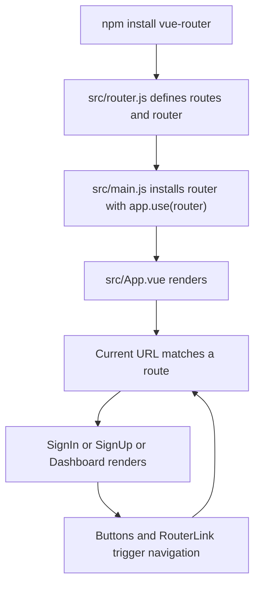

# Vue Router - How It Works

This document explains the mechanics behind the vue-router setup in this session. It focuses on what happens at runtime and how each edited or created file connects to the others.

---

## The Big Picture

```text
Browser URL -> Router matches path -> <router-view> renders the matched component
```

Vue Router turns the URL into application state. Instead of doing a full page reload for each navigation, it matches the current path to a route record and swaps the component rendered in the app shell.

---

## 1. Why `vue-router` Must Be Installed First

```bash
npm install vue-router
```

What it does at runtime:
- The command adds the Vue Router package to the project so the browser bundle can include it.
- Without the installed package, imports such as `createRouter`, `createWebHistory`, and `useRouter` cannot resolve.

Why it is needed:
- The rest of the setup depends on APIs exported by the `vue-router` package.

How it connects:
- `src/router.js` imports `createRouter` and `createWebHistory` from this package.
- `SignIn.vue`, `SignUp.vue`, and `Dashboard.vue` import `useRouter` or use `RouterLink` features provided by the installed router.

---

## 2. How the Router Instance Is Created

This file defines the routing table and the router instance that controls which page component appears for each URL.

| Part | What it does at runtime | Why it is needed | How it connects |
| --- | --- | --- | --- |
| `import SignIn`, `import SignUp`, `import Dashboard` | Loads the components that can be rendered for matching routes | The router needs concrete components to display | These become the `component` values inside `routes` |
| `createRouter(...)` | Creates a central router object | Vue Router works through one shared router instance | This instance is installed in `main.js` |
| `createWebHistory()` | Uses the browser History API for navigation | It keeps URLs clean without hash fragments | Browser back and forward actions then work with router navigation |
| `routes` array | Declares path-to-component and name-to-component mappings | The app needs explicit rules for which view to render | `router-view` uses the matched route from this list |
| `redirect: { name: 'SignIn' }` | Sends unmatched URLs to the sign-in route | The app needs a safe fallback for unknown paths | The catch-all route uses the named route from the same route table |
| `export default router` | Makes the configured router reusable in other files | The app entry file must import and install it | `main.js` calls `.use(router)` |

```js
const routes = [
    {
        path: '/',
        name: 'SignIn',
        component: SignIn,
    },
    {
        path: '/signup',
        name: 'SignUp',
        component: SignUp,
    },
    {
        path: '/dashboard',
        name: 'Dashboard',
        component: Dashboard,
    },
    { path: '/:pathMatch(.*)*', redirect: { name: 'SignIn' } },
];
```

At runtime, when the URL matches one of these `path` values, Vue Router picks the corresponding `component`. The `name` values make navigation easier from components because they let code target a route symbolically instead of repeating path strings everywhere.

The last route is a catch-all fallback. If the user enters a URL that does not match `/`, `/signup`, or `/dashboard`, Vue Router matches `/:pathMatch(.*)*` and redirects to the route named `SignIn`.

---

## 3. How the Router Is Registered

This step attaches the router to the Vue application before the app mounts.

```js
import router from './router';

createApp(App).use(router).mount('#app')
```

What it does at runtime:
- `import router from './router';` loads the shared router instance.
- `.use(router)` registers Vue Router as a plugin on the application.
- After registration, routing features like `router-view`, `router-link`, and `useRouter()` are available in components.

Why it is needed:
- Without this step, the router exists as a file but is never connected to the application.

How it connects:
- It consumes the router created in `src/router.js`.
- It enables `src/App.vue` to render route matches and the route components to navigate.

---

## 4. How Route Rendering Works

This change turns the root component into a routing outlet.

```vue
<template>
  <router-view />
</template>
```

What it does at runtime:
- `router-view` renders the component for the currently matched route.
- When the URL changes, the displayed component changes automatically.

Why it is needed:
- Even with a configured router, the app still needs a place in the DOM where route components can appear.

How it connects:
- It depends on the router being installed in `main.js`.
- It renders the components that were mapped in `src/router.js`.

At runtime, the flow looks like this:

```text
URL: /           -> router-view renders SignIn
URL: /signup     -> router-view renders SignUp
URL: /dashboard  -> router-view renders Dashboard
URL: anything else -> router redirects to SignIn
```

---

## 5. How Programmatic Navigation Works

The auth components use the router instance directly to trigger navigation when buttons are clicked.

### `src/components/auth/SignIn.vue`

This component demonstrates programmatic navigation with `replace`.

```vue
<script setup>
import { useRouter } from 'vue-router'
const router = useRouter()

function goToDashboard() {
    router.replace('/dashboard')
}

function goToSignUp() {
    router.replace({ name: 'SignUp' })
}
</script>
```

What it does at runtime:
- `useRouter()` returns the active router instance for this component.
- Clicking the first button navigates to `/dashboard`.
- Clicking the second button navigates to the route named `SignUp`.
- Because `replace` is used, the current history entry is overwritten rather than adding a new one.

Why it is needed:
- It shows how a component can trigger navigation in response to user actions.
- It also demonstrates both path-based and name-based navigation.

How it connects:
- The route names and paths must match the definitions in `src/router.js`.
- The component is displayed when `/` is matched inside `router-view`.

### `src/components/auth/SignUp.vue`

This component demonstrates programmatic navigation with `push`.

```vue
<script setup>
import { useRouter } from 'vue-router'
const router = useRouter()

function goToDashboard() {
    router.push('/dashboard')
}

function goToSignIn() {
    router.push({ name: 'SignIn' })
}
</script>
```

What it does at runtime:
- `useRouter()` exposes the router instance again.
- Clicking a button navigates either by direct path or by route name.
- `push` adds a new history entry, so the browser can move back to the previous page.

Why it is needed:
- It contrasts with `replace` by keeping navigation history.

How it connects:
- The `SignIn` route name and `/dashboard` path come from `src/router.js`.
- This component is rendered when the current route is `/signup`.

`replace()` and `push()` both change routes, but they differ in browser history behavior:

| Method | Runtime effect | History result |
| --- | --- | --- |
| `router.replace(...)` | Navigates to a new route immediately | Replaces the current history entry |
| `router.push(...)` | Navigates to a new route immediately | Adds a new history entry |

---

## 6. How Links and History Navigation Work

### `src/components/pages/Dashboard.vue`

This component shows both declarative links and direct history control.

```vue
<template>
    <RouterLink to="/signup">Go to Sign Up</RouterLink>
    <router-link :to="{ name: 'SignIn' }">Go to Sign In</router-link>
    <button @click="goBack">Go Back</button>
    <button @click="goForward">Go Forward</button>
</template>
```

```vue
<script setup>
import { useRouter } from 'vue-router'
const router = useRouter()

function goBack() {
    router.go(-1);
}

function goForward() {
    router.go(1);
}
</script>
```

What it does at runtime:
- `RouterLink` renders clickable links that update the current route without a full page reload.
- The first link uses a path string.
- The second link uses a named route object.
- `router.go(-1)` tells the browser history to move one step backward.
- `router.go(1)` tells the browser history to move one step forward.

Why it is needed:
- It demonstrates the two common navigation styles used in the staged changes: link-based navigation and programmatic history movement.

How it connects:
- The link targets depend on the routes declared in `src/router.js`.
- The component itself is what `router-view` shows when `/dashboard` is active.

`RouterLink` is the declarative option because the template states where the user should go. `router.go()` is imperative because the component code tells the router to move through browser history by a specific number of steps.

---

## Summary Flow



Runtime sequence:
1. `vue-router` is installed so the app can import router APIs.
2. The app creates and installs the router.
3. `router-view` waits for the current route match.
4. Vue Router selects the matching component from the `routes` array.
5. The rendered component can navigate by path, by route name, by link, or by history movement.
6. Each navigation updates the current route, and `router-view` renders the next matching component.