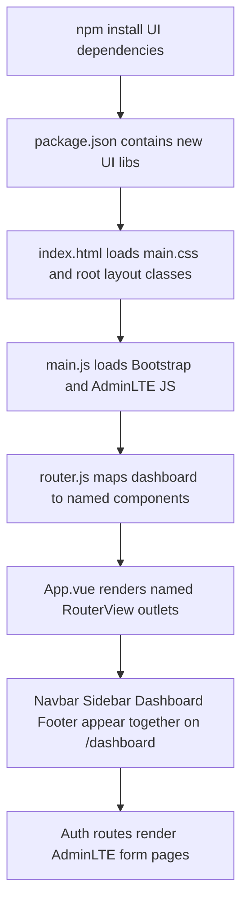

# AdminLTE Layout and Named Views - Explained

This document explains how the staged changes transform a basic Vue Router app into an AdminLTE-based interface with shared layout includes and named route outlets.

---

## The Big Picture

```text
Install UI libs -> Load global CSS/JS -> Define named dashboard views -> Render each layout region via RouterView
```

The app keeps existing route navigation, but changes how dashboard pages render. Instead of a single page component, `/dashboard` now composes multiple components (`navbar`, `sidebar`, `default`, `footer`) through Vue Router named views.

---

## 1. Run Command: Install AdminLTE UI Dependencies - Explained

```bash
npm install @fortawesome/fontawesome-free admin-lte bootstrap husky icheck-bootstrap
```

What it does at runtime:
- Installs libraries that provide CSS classes, icons, and JavaScript behaviors referenced by the staged templates.

Why it is needed:
- `src/main.css` and `src/main.js` import assets from these packages.
- Without these packages, style imports and JS plugin imports fail.

How it connects:
- Font Awesome classes in auth/navbar/sidebar templates depend on `@fortawesome/fontawesome-free`.
- AdminLTE and Bootstrap classes/data-widget hooks depend on `admin-lte` and `bootstrap`.
- `icheck-bootstrap` is imported in global CSS.

---

## 2. Edit: `package.json` - Explained

The dependency section is expanded to include the UI stack.

What it does at runtime:
- Dependency versions determine what Vite can resolve and bundle when imports are executed.

Why it is needed:
- Newly introduced imports in `main.css` and `main.js` need matching installed packages.

How it connects:
- This change supports all later steps that import framework CSS/JS or icon classes.

---

## 3. Create New: `src/main.css` - Explained

```css
@import url('https://fonts.googleapis.com/css?family=Source+Sans+Pro:300,400,400i,700&display=fallback');
@import '@fortawesome/fontawesome-free/css/all.min.css';
@import 'icheck-bootstrap/icheck-bootstrap.min.css';
@import 'admin-lte/dist/css/adminlte.min.css';
```

What it does at runtime:
- Loads typography, icon styles, and AdminLTE theme styles globally before components render.

Why it is needed:
- Template class names like `main-sidebar`, `card`, `fas fa-lock`, and `navbar` only look correct when these styles are present.

How it connects:
- `index.html` includes this file so every route gets the same global UI baseline.

---

## 4. Edit: `index.html` - Explained

What it does at runtime:
- Adds global stylesheet loading and applies AdminLTE layout classes on root elements.

Why it is needed:
- AdminLTE expects structural classes (`sidebar-mini`, `layout-fixed`, `wrapper`) at the top-level layout.

How it connects:
- The new classes align the shell for named views rendered from `App.vue` and `router.js`.

---

## 5. Edit: `src/main.js` - Explained

```js
import 'bootstrap/dist/js/bootstrap.bundle.min.js';
import 'admin-lte/dist/js/adminlte.min.js';
```

What it does at runtime:
- Loads Bootstrap + AdminLTE JavaScript plugins before mounting Vue.

Why it is needed:
- Navbar/sidebar widget attributes (`data-widget=...`) rely on AdminLTE/Bootstrap JS behavior.

How it connects:
- The markup in `Navbar.vue` and `Sidebar.vue` references these behaviors directly.

---

## 6. Create New: Shared Layout Include Components - Explained

Files created:
- `src/components/includes/Navbar.vue`
- `src/components/includes/Sidebar.vue`
- `src/components/includes/Footer.vue`

What they do at runtime:
- `Navbar.vue` renders top navigation controls.
- `Sidebar.vue` renders brand/user/menu area and dashboard navigation link.
- `Footer.vue` renders the persistent footer area.

Why they are needed:
- They split dashboard chrome from page content, enabling layout reuse and cleaner route composition.

How they connect:
- `router.js` assigns these components to named route outlets.
- `App.vue` renders the matching named `RouterView` placeholders.

---

## 7. Edit: `src/router.js` - Explained

Core route change for `/dashboard`:

```js
{
    path: '/dashboard',
    name: 'Dashboard',
    components: {
        navbar: Navbar,
        sidebar: Sidebar,
        footer: Footer,
        default: Dashboard,
    },
}
```

What it does at runtime:
- Uses `components` (plural) so one route renders multiple Vue components simultaneously.

Why it is needed:
- A dashboard layout needs multiple persistent regions, not a single component slot.

How it connects:
- Keys (`navbar`, `sidebar`, `footer`, `default`) must match `name` values in `App.vue` RouterViews.

Named view mapping table:

| Route component key | RouterView target |
| --- | --- |
| `navbar` | `<RouterView name="navbar" />` |
| `sidebar` | `<RouterView name="sidebar" />` |
| `default` | `<RouterView name="default" />` |
| `footer` | `<RouterView name="footer" />` |

---

## 8. Edit: `src/App.vue` - Explained

```vue
<template>
  <RouterView name="navbar" />
  <RouterView name="sidebar" />
  <RouterView name="default" />
  <RouterView name="footer" />
</template>
```

What it does at runtime:
- Defines four rendering outlets for route-driven layout composition.

Why it is needed:
- Without named outlets, router `components` keys in `/dashboard` have nowhere to render.

How it connects:
- Directly receives the components object from the active route in `router.js`.

---

## 9. Edit: Auth and Dashboard Page Components - Explained

Changed files:
- `src/components/auth/SignIn.vue`
- `src/components/auth/SignUp.vue`
- `src/components/pages/Dashboard.vue`

What it does at runtime:
- Auth pages now render AdminLTE form cards and route links.
- Dashboard page now renders an AdminLTE content wrapper and breadcrumb structure.

Why it is needed:
- Aligns page-level UI with the new global AdminLTE layout and style imports.

How it connects:
- These are still route content components, but now visually and structurally fit the named-view shell.

---

## Summary Flow



Runtime sequence:
1. The UI dependency stack is installed and available to imports.
2. Global CSS and JS are loaded at app startup.
3. Router config maps dashboard to named components.
4. `App.vue` exposes matching named outlets.
5. Route components render with AdminLTE classes and behavior.
6. Dashboard becomes a composed layout while auth pages remain standalone views.
