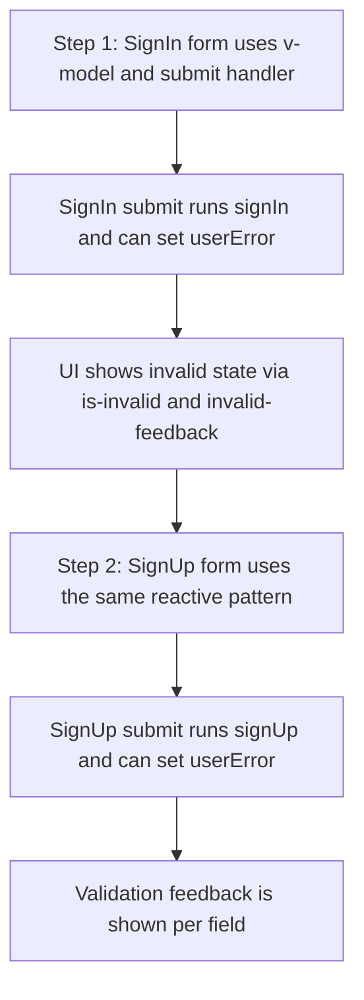

# Reactive Auth Forms - Explained

This document explains how the staged auth-form changes work at runtime and why each part is needed.

---

## The Big Picture

The sign-in and sign-up pages were upgraded from static HTML inputs to reactive Vue forms. Each field now writes into state, each form has a controlled submit handler, and each field can show inline error feedback.

```text
User types -> v-model updates reactive state -> submit handler runs -> errors populate userError -> UI reflects errors
```

---

## 1. Edit: `SignIn.vue` - Explained

### What changed
- The form now uses `@submit.prevent="signIn"`.
- Email/password inputs now use `v-model`.
- Invalid class binding and `invalid-feedback` blocks were added.
- Reactive `user` and `userError` objects were introduced in `<script setup>`.

### What it does at runtime
- `v-model` keeps the input value and `user` state synchronized in both directions.
- Submitting the form calls `signIn()` without a full page reload.
- If `userError.email` or `userError.password` becomes a non-empty string, Vue applies `is-invalid` and shows the related feedback block.

### Why it is needed
- A submit handler centralizes login logic instead of relying on native browser form submission.
- Reactive state is required for validation and API payload creation.
- Error bindings connect validation output directly to the correct input field.

### How it connects to other parts
- The same form architecture is reused in `SignUp.vue` so auth pages behave consistently.
- `signIn()` acts as the hook for future API integration while preserving current UI behavior.

---

## 2. Edit: `SignUp.vue` - Explained

### What changed
- The form now uses `@submit.prevent="signUp"`.
- Inputs for `name`, `email`, `password`, and `password_confirmation` were bound with `v-model`.
- Error-driven invalid styling was added for `name`, `email`, and `password`.
- Reactive `user` and `userError` objects plus `signUp()` were added.

### What it does at runtime
- Every keystroke updates the `user` object immediately.
- Form submission triggers `signUp()` and prevents page reload.
- Error keys in `userError` control whether each field looks invalid and displays feedback text.
- `password_confirmation` is stored in state so it can be compared against `password` during validation.

### Why it is needed
- Registration forms typically need multiple fields and cross-field checks.
- Centralized reactive data makes validation and submission deterministic.
- UI feedback becomes predictable because each error maps to one field.

### How it connects to other parts
- Uses the same reactive pattern as `SignIn.vue`, reducing maintenance complexity.
- `signUp()` is prepared for adding validation + API calls in the next development step.

---

## Runtime Pattern Reference

| Piece | Runtime role | Why it matters |
| --- | --- | --- |
| `v-model` | Syncs input and state | Keeps template and data consistent |
| `@submit.prevent` | Intercepts native submit | Lets Vue control submit flow |
| `user` (reactive) | Holds form values | Source of truth for API payloads |
| `userError` (reactive) | Holds field errors | Source of truth for validation UI |
| `is-invalid` binding | Toggles invalid style | Visual cue for incorrect input |
| `invalid-feedback` | Displays error text | Explains exactly what is wrong |

---

## Summary Flow



End-to-end sequence:
1. Step 1 configures `SignIn.vue` so input changes update reactive `user` state.
2. Submitting Sign In triggers `signIn()` and can populate `userError` keys.
3. The template reflects those keys through `is-invalid` and `invalid-feedback`.
4. Step 2 applies the same structure to `SignUp.vue` with extra registration fields.
5. Submitting Sign Up triggers `signUp()` and renders field-specific feedback in the same way.
