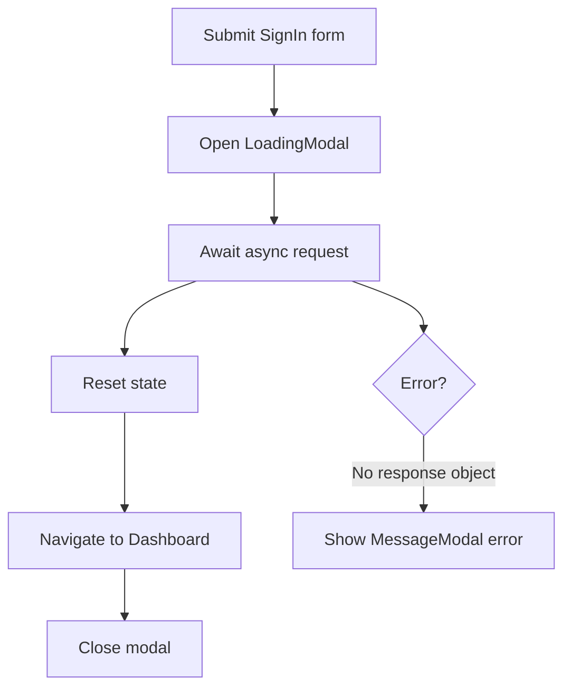
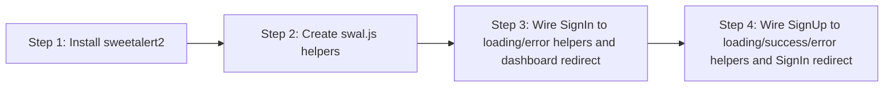

# SweetAlert2 Auth Feedback - Explained

This document explains how the SweetAlert2 auth-flow setup works at runtime and how each step connects to form state, async behavior, and routing.

---

## The Big Picture

The auth components now delegate user feedback to reusable SweetAlert2 helpers. Instead of silent waits or console-only behavior, users see loading states, result messages, and route transitions tied to async outcomes.

```text
Install dependency -> create modal helpers -> use helpers in SignIn -> use helpers in SignUp
```

---

## Step 1 - Run Command: Install SweetAlert2 - Explained

### What it does at runtime
- Installing `sweetalert2` makes the `Swal` API available to your app at build and runtime.
- Without this dependency, imports from `sweetalert2` fail and modal code cannot execute.

### Why it is needed
- All new feedback behavior (`LoadingModal`, `MessageModal`, `CloseModal`) wraps `Swal.fire(...)` and `Swal.close()`.
- The helper file and auth components depend on this package before any modal integration can work.

### How it connects to other parts
- Step 2 imports `Swal` directly from this dependency.
- Steps 3 and 4 call helper functions built on top of this package.

---

## Step 2 - Create New: `src/functions/swal.js` - Explained

### What it does at runtime
- `LoadingModal(text)` opens a non-dismissible popup and starts the loading spinner.
- `MessageModal(options, callback)` shows a result message, then optionally runs additional logic.
- `CloseModal()` force-closes the currently open popup.

### Why it is needed
- It centralizes modal behavior so auth components stay focused on auth logic.
- Reuse prevents duplicated popup configuration across multiple pages.

### How it connects to other parts
- `SignIn.vue` uses `LoadingModal`, `MessageModal`, and `CloseModal`.
- `SignUp.vue` uses `LoadingModal` and `MessageModal`.
- The callback support in `MessageModal` is used by sign-up to navigate after success.

### Helper behavior map

| Helper | Runtime behavior | Used by |
| --- | --- | --- |
| `LoadingModal(text)` | Opens loading popup and spinner | SignIn, SignUp |
| `MessageModal(options, callback)` | Shows message, then runs optional callback | SignIn (error), SignUp (success + error) |
| `CloseModal()` | Closes active SweetAlert modal | SignIn |

---

## Step 3 - Edit: `src/components/auth/SignIn.vue` - Explained

### What it does at runtime
- `signIn()` shows `LoadingModal('Signing In...')` immediately when submit starts.
- The async delay simulates an API request while the loading UI remains visible.
- On success, `resetAllState()` clears form and error objects, then `router.replace({ name: "Dashboard" })` navigates.
- `CloseModal()` removes the loading popup after successful transition.
- On unexpected runtime/network errors (no `response`), `MessageModal({ icon: "error", ... })` displays a user-facing error.

### Why it is needed
- Users need visible feedback during async operations to avoid repeated submissions and confusion.
- Resetting state prevents stale input/error data from leaking into later interactions.
- Programmatic navigation completes the sign-in flow automatically.

### How it connects to other parts
- Relies on reusable helper functions from Step 2.
- Mirrors the same async-feedback pattern later reused in Step 4 (SignUp).

### Sign-in flow diagram



---

## Step 4 - Edit: `src/components/auth/SignUp.vue` - Explained

### What it does at runtime
- `signUp()` starts with `LoadingModal('Signing Up...')` during async work.
- After simulated success, it clears form/error state via `resetAllState()`.
- It then returns `MessageModal({ icon: "success", ... }, callback)`.
- When that message completes, the callback runs `router.replace({ name: "SignIn" })`.
- If an unexpected error occurs, `MessageModal({ icon: "error", ... })` informs the user.

### Why it is needed
- Sign-up should confirm account creation before redirecting users.
- Callback-based redirect ensures navigation happens in the intended sequence after success messaging.
- Shared error handling keeps failure feedback consistent across auth screens.

### How it connects to other parts
- Uses the same helper abstraction and reset strategy introduced in Step 2 and used in Step 3.
- Keeps auth UX consistent: loading state first, outcome message second, route change last.

### Sign-up success sequence

```text
Submit -> LoadingModal -> async request -> reset state -> success MessageModal -> callback redirect to SignIn
```

---

## Summary Flow



End-to-end sequence:
1. Add SweetAlert2 dependency so modal APIs are available.
2. Build reusable helper functions in `swal.js`.
3. Use helpers in sign-in for loading feedback, error messaging, state reset, and dashboard navigation.
4. Use helpers in sign-up for loading feedback, success confirmation, error messaging, state reset, and redirect back to sign-in.
