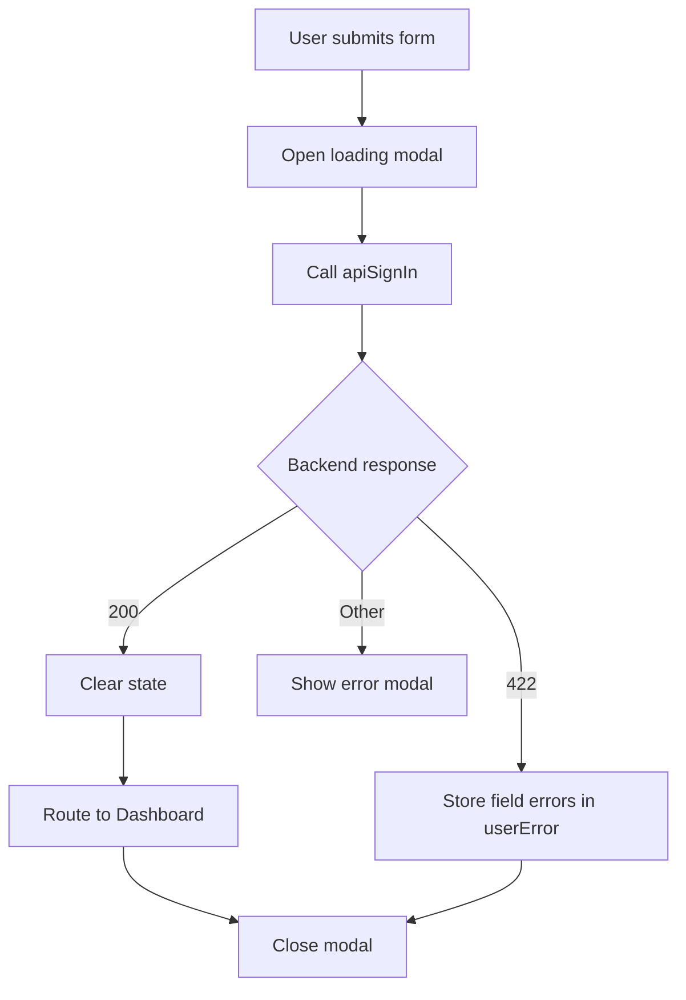
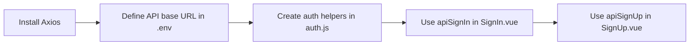

# Axios Auth API Calls — Explained

This companion note explains how the Axios-based auth layer works at runtime. It follows the same step order as the main guide so the setup path and the underlying behavior stay aligned.

---

## The Big Picture

The auth flow now looks like a small pipeline: install the HTTP client, provide a backend base URL, centralize request logic, then let the sign-in and sign-up pages react to the returned status codes and data.

```text
Axios -> env base URL -> auth helper functions -> SignIn/SignUp UI flow
```

---

## Step 1 - Run Command: Install Axios - Explained

### What it does at runtime
- Installing `axios` adds the request library that the browser bundle will use to talk to the API.
- The auth helper file imports Axios directly, so the app cannot build this layer without the dependency.

### Why it is needed
- The previous simulated `setTimeout` flow cannot hit a real backend.
- Axios provides the `post` and `get` calls that the auth helper functions rely on.

### How it connects to other parts
- Step 3 depends on the Axios import.
- Steps 4 and 5 depend on the helper functions that are built on top of Axios.

---

## Step 2 - Create New: `.env` - Explained

### What it does at runtime
- `VITE_APP_API_URL` becomes available to the client through Vite's environment injection.
- The helper file reads that value once and reuses it for every auth endpoint.

### Why it is needed
- A single base URL keeps endpoint definitions short and consistent.
- Changing environments later only requires changing the `.env` value, not the component logic.

### How it connects to other parts
- `import.meta.env.VITE_APP_API_URL` is read in Step 3.
- If the backend host changes, the auth pages keep working as long as this value is updated.

---

## Step 3 - Create New: `src/functions/api/auth.js` - Explained

### What it does at runtime
- `apiSignUp(user)` sends registration data to the server.
- `apiSignIn(user)` sends login credentials to the server.
- `apiSignOut(token)` sends a bearer-authenticated sign-out request.
- `apiVerify(token)` sends a bearer-authenticated token check request.

### Why it is needed
- It keeps endpoint paths and authorization headers out of the Vue components.
- Centralizing the logic makes the auth pages easier to read and easier to change later.

### How it connects to other parts
- `SignIn.vue` uses `apiSignIn(user)` and then reacts to success, validation errors, or other failures.
- `SignUp.vue` uses `apiSignUp(user)` and follows the same response pattern.
- `apiSignOut` and `apiVerify` prepare the project for token-based authenticated flows.

### Endpoint table

| Function | Method | Endpoint | Runtime role |
| --- | --- | --- | --- |
| `apiSignUp(user)` | `POST` | `/signup` | Create a new account |
| `apiSignIn(user)` | `POST` | `/signin` | Authenticate a user |
| `apiSignOut(token)` | `POST` | `/signout` | Invalidate the current session |
| `apiVerify(token)` | `GET` | `/verify` | Confirm the token is still valid |

---

## Step 4 - Edit: `src/components/auth/SignIn.vue` - Explained

### What it does at runtime
- Submit triggers `signIn()` instead of a plain form post.
- `LoadingModal('Signing In...')` opens immediately so the user sees that work is in progress.
- `apiSignIn(user)` sends the current form state to the backend.
- When the request succeeds, `resetAllState()` clears stale values and `router.replace({ name: "Dashboard" })` performs the redirect.
- If the backend returns `422`, the code copies the first error for each field into `userError`, which drives the invalid feedback display.
- Any other failure is shown through `MessageModal({ icon: "error", ... })`.

### Why it is needed
- Loading feedback prevents duplicate submissions and uncertainty.
- Field-specific validation helps the user correct the exact input that failed.
- Redirecting with `replace` completes the login flow cleanly.

### How it connects to other parts
- Depends on the helper layer from Step 3.
- Uses the same modal utilities already introduced in the auth flow.
- Mirrors the same error handling pattern used in Step 5.

### Runtime sequence



---

## Step 5 - Edit: `src/components/auth/SignUp.vue` - Explained

### What it does at runtime
- Submit triggers `signUp()` and opens `LoadingModal('Signing Up...')`.
- `apiSignUp(user)` sends the registration payload to the server.
- On success, `resetAllState()` wipes the form and validation messages.
- `MessageModal({ icon: "success", ... }, callback)` shows the success state and then executes the redirect callback.
- The callback sends the user back to the sign-in page with `router.replace({ name: "SignIn" })`.
- `422` responses are unpacked into `userError` so the template can show field-specific feedback.
- Other errors are reported through the error branch of `MessageModal(...)`.

### Why it is needed
- Registration should confirm success before navigation.
- The callback keeps the redirect tied to the message flow, so the order stays predictable.
- Reusing the same validation strategy keeps the auth experience consistent.

### How it connects to other parts
- Calls the registration helper from Step 3.
- Uses the same modal and error-handling patterns as Step 4.
- Completes the loop by returning the user to sign-in after account creation.

### Runtime sequence

```text
Submit -> loading modal -> API request -> reset state -> success modal -> redirect to SignIn
```

---

## Summary Flow



End-to-end sequence:
1. Add Axios so the frontend can send HTTP requests.
2. Store the API base URL in the Vite environment file.
3. Build reusable auth request functions on top of Axios.
4. Let sign-in handle loading, validation, and dashboard navigation.
5. Let sign-up handle loading, validation, success messaging, and redirecting back to sign-in.