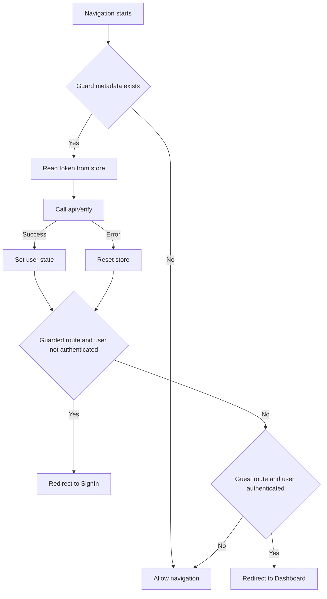
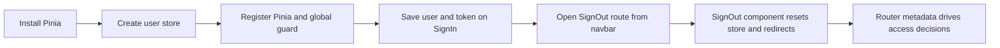

# Pinia Auth State and Route Guards — Explained

This note explains how the Pinia auth setup works at runtime, including state persistence, navigation-time token checks, route metadata access control, and sign-out flow orchestration.

---

## The Big Picture

The setup links together store state, route metadata, and API verification so route access decisions happen automatically during navigation.

```text
Install Pinia -> create user store -> register guard in main.js -> write auth state on login -> sign out through route action -> route metadata controls access
```

---

## Step 1 - Run Command: Install Pinia - Explained

### What it does at runtime
- Installing `pinia` makes the store runtime available for `defineStore`, app plugin registration, and store usage inside components and router hooks.

### Why it is needed
- The auth flow now needs shared user state and token utilities that survive page transitions.

### How it connects to other parts
- Step 2 creates the user store with Pinia.
- Step 3 registers Pinia on app boot.
- Steps 4 and 5 consume store actions/getters.

---

## Step 2 - Create New: `src/stores/user.js` - Explained

### What it does at runtime
- Holds user profile fields in reactive store state.
- Exposes auth status through `isAuthenticated`.
- Saves, reads, and removes Sanctum token via `localStorage` helpers.
- Provides `reset()` to clear both state and token.

### Why it is needed
- Components and navigation guards need one source of truth for authenticated state.
- Token helpers keep storage logic centralized instead of scattered across files.

### How it connects to other parts
- `SignIn.vue` writes user and token using store actions.
- `main.js` guard reads token and auth status using the store.
- `SignOut.vue` calls `reset()` to clear local session state.

### Store action map

| Action / Getter | Runtime purpose | Used by |
| --- | --- | --- |
| `setState(user)` | Hydrate user profile after successful verify/sign-in | SignIn, main guard |
| `setSanctumToken(token)` | Persist token for future requests | SignIn |
| `getSanctumToken()` | Retrieve token for verify/sign-out API calls | main guard, SignOut |
| `isAuthenticated` | Boolean auth check (`!!state.id`) | main guard |
| `reset()` | Clear state + remove token | main guard, SignOut |

---

## Step 3 - Edit: `src/main.js` - Explained

### What it does at runtime
- Creates Pinia and mounts it with the Vue app.
- Registers `router.beforeEach(...)` to run before each navigation.
- Reads `to.meta.guarded` to determine whether auth checks apply.
- On guarded/auth routes, verifies the token with `apiVerify(token)`.
- Sets user state on successful verify; resets on failure.
- Redirects guests away from guarded routes and authenticated users away from guest-only routes.

### Why it is needed
- Auth decisions must happen before protected views render.
- Verifying stored tokens prevents stale or invalid sessions from being treated as authenticated.

### How it connects to other parts
- Depends on `useUserStore()` from Step 2.
- Uses `meta.guarded` values configured in Step 7.
- Uses token set by Step 4 and cleared by Step 5.

### Guard decision flow



---

## Step 4 - Edit: `src/components/auth/SignIn.vue` - Explained

### What it does at runtime
- After `apiSignIn(user)` succeeds, it stores user profile and token in Pinia.
- Continues existing behavior: reset form state, navigate to dashboard, close modal.
- Keeps validation/network/server error handling paths unchanged.

### Why it is needed
- Login success must update global auth state immediately.
- The route guard relies on stored token and auth state during later navigations.

### How it connects to other parts
- Writes to the store from Step 2.
- Feeds token into verify/sign-out calls used in Steps 3 and 5.
- Redirect to dashboard is later protected by the guarded-route system from Step 7.

---

## Step 5 - Create New: `src/components/auth/SignOut.vue` - Explained

### What it does at runtime
- Runs on component mount when `/signout` is visited.
- Reads token from store and calls `apiSignOut(token)`.
- Immediately clears local state and token using `userStore.reset()`.
- Redirects user to SignIn route.

### Why it is needed
- Provides a dedicated logout endpoint in the UI flow.
- Ensures local sign-out completes even if backend logout call fails or is delayed.

### How it connects to other parts
- Triggered from the navbar confirmation in Step 6.
- Route is registered in Step 7.
- Uses store and auth API utilities introduced in earlier steps.

---

## Step 6 - Edit: `src/components/includes/Navbar.vue` - Explained

### What it does at runtime
- Adds a sign-out action icon to the navbar.
- Shows a SweetAlert confirmation modal before logout.
- If confirmed, navigates to the `SignOut` route.

### Why it is needed
- Prevents accidental sign-outs.
- Keeps logout logic centralized by routing to the dedicated sign-out component.

### How it connects to other parts
- Starts the sign-out route flow handled by Step 5.
- Works with route registration from Step 7.

---

## Step 7 - Edit: `src/router.js` - Explained

### What it does at runtime
- Registers `SignOut` route component.
- Adds `meta.guarded: false` to SignIn and SignUp.
- Adds `meta.guarded: true` to Dashboard.
- Leaves SignOut without `guarded` metadata so it can run in either auth state.

### Why it is needed
- Global guard logic needs route metadata to know which redirect rule to apply.
- Sign-out route must remain accessible for cleanup regardless of current auth status.

### How it connects to other parts
- Read by `router.beforeEach(...)` in Step 3.
- Powers transitions initiated by SignIn success and navbar sign-out actions.

### Route metadata map

| Route | guarded meta | Behavior with global guard |
| --- | --- | --- |
| `SignIn` | `false` | Redirect authenticated users to dashboard |
| `SignUp` | `false` | Redirect authenticated users to dashboard |
| `Dashboard` | `true` | Redirect guests to sign-in |
| `SignOut` | _undefined_ | Skip guard checks; execute component cleanup logic |

---

## Summary Flow



End-to-end sequence:
1. Add Pinia dependency.
2. Create a reusable user store with profile and token actions.
3. Register a navigation guard that verifies token and enforces route access.
4. Persist user and token right after successful sign-in.
5. Trigger sign-out from navbar confirmation.
6. Run logout cleanup in the SignOut route component.
7. Use route metadata so access control stays declarative and centralized.
