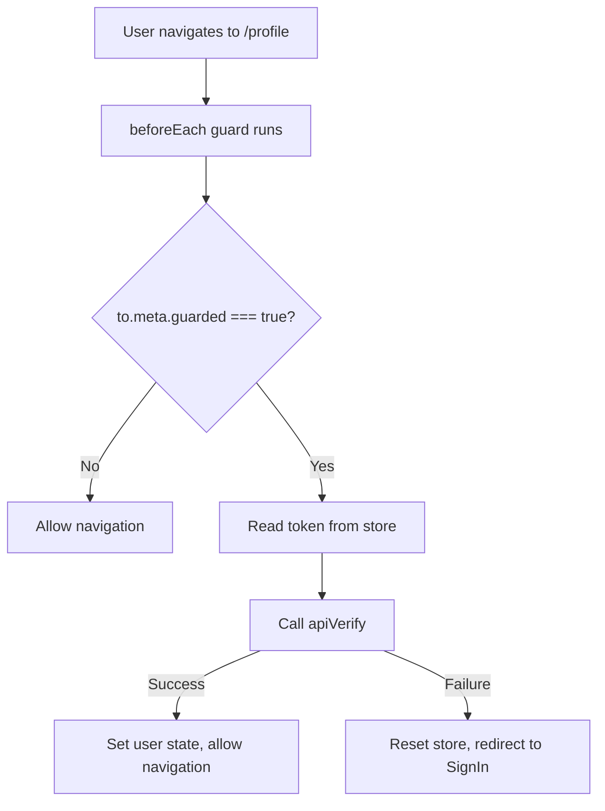
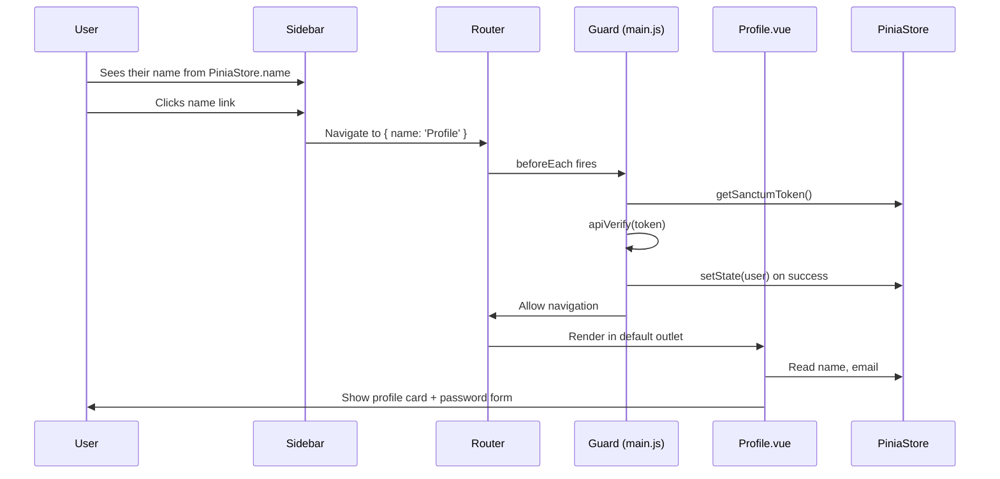

# User Profile Page — Explained

This note explains the concepts, patterns, and runtime behaviour behind the Profile page setup — covering reactive form state, field-level validation binding, named-view routing, route guards, and dynamic store-driven UI in the sidebar.

---

## The Big Picture

The three changes in this session work together to create an authenticated-only profile experience:

```text
Create Profile.vue -> register /profile route -> update Sidebar link
     ↓                        ↓                          ↓
Renders form UI      Guards page with meta         Shows real username
Reads store state    Uses named views layout       Links to Profile route
```

The Pinia user store (set up in Session 2.3) is the shared source of truth that both `Profile.vue` and `Sidebar.vue` read from without any prop drilling.

---

## Step 1 - Edit: `src/components/includes/Sidebar.vue` — Explained

### What it does at runtime
- `useUserStore()` returns the live Pinia store instance. Because Pinia state is reactive, `{{ userStore.name }}` in the template automatically re-renders whenever the store's `name` field changes — for example, after a profile update.
- `:to="{ name: 'Profile' }"` tells Vue Router to resolve the link using the route's registered name rather than a literal path string.

### Why it is needed
- Hardcoding a username in the sidebar was a placeholder; displaying the real name from the store makes the sidebar reflect actual authenticated state.
- Linking to the Profile page from the sidebar follows the AdminLTE convention of making the user panel clickable for profile management.

### Why use the route name instead of the path

| Approach | Example | Risk |
| --- | --- | --- |
| Literal path | `:to="'/profile'"` | Breaks silently if the path is changed in `router.js` |
| Named route | `:to="{ name: 'Profile' }"` | Vue Router throws a warning if the name doesn't exist — easier to catch mistakes |

### Reactivity of `useUserStore()` in a component

```text
Pinia store state changes (e.g. after sign-in)
    → Vue's reactivity system detects the change
    → Sidebar template re-renders {{ userStore.name }}
    → User sees their real name without a page reload
```

No watchers, computed properties, or event listeners are needed — the template binding is sufficient because `useUserStore()` returns a reactive proxy.

---

## Step 2 - Edit: `src/router.js` — Explained

### What it does at runtime
- Vue Router matches the URL `/profile`, looks up the `Profile` route definition, and renders each named component into its corresponding `<router-view name="...">` outlet in `App.vue`.
- Before the navigation completes, the `beforeEach` guard in `main.js` reads `to.meta.guarded` — because it is `true`, it verifies the Sanctum token; if verification fails, it redirects to `SignIn`.

### Why it is needed
- The Profile page must participate in the same full-page layout (navbar + sidebar + footer) as Dashboard, so it uses `components` (plural named views) rather than a single `component`.
- `meta: { guarded: true }` is the only change needed to opt the route into the existing authentication guard — no guard logic needs to be duplicated.

### Why `components` (plural) instead of `component`

```js
// Single outlet — component key (singular)
{ path: '/signin', component: SignIn }

// Multiple named outlets — components key (plural)
{
  path: '/profile',
  components: {
    navbar: Navbar,
    sidebar: Sidebar,
    footer: Footer,
    default: Profile,   // fills <router-view> with no name attribute
  },
}
```

- `default` maps to any `<router-view>` that has no `name` attribute (the main content area).
- All four outlets are filled **simultaneously** in a single navigation — there is no waterfall or secondary render.

### Route guard interaction



---

## Step 3 - Create New: `src/components/auth/Profile.vue` — Explained

### What it does at runtime
- Reads `userStore.name` and `userStore.email` directly from Pinia and renders them in the profile card.
- Maintains two independent reactive objects — `user` for form inputs and `userError` for per-field validation messages.
- When the form is submitted, `@submit.prevent` stops the browser default and calls `savePassword()`.
- Bootstrap's `is-invalid` class is toggled on each input depending on whether its matching error string is non-empty.

### Why it is needed
- A dedicated profile page gives authenticated users a central place to view their identity and manage their credentials.
- Separating form data (`user`) from error state (`userError`) keeps template bindings clean and makes it straightforward to update just the error messages without touching input values.

### How it connects to other parts
- Relies on `useUserStore()` from the Pinia store created in Session 2.3 — without that store, `userStore.name` and `userStore.email` would be undefined.
- The `savePassword()` function is intentionally empty — it will call an API function in a future session.
- The breadcrumb uses `:to="{ name: 'Dashboard' }"`, which depends on the Dashboard route already registered in `router.js`.

### `reactive` vs `ref` for form state

| Pattern | Best for | Why |
| --- | --- | --- |
| `reactive({...})` | grouped object fields (form rows) | Access fields as `user.current_password` — no `.value` unwrapping needed in template or script |
| `ref(value)` | single scalar values | Requires `.value` in script; auto-unwrapped in template |

Using `reactive` for both `user` and `userError` mirrors the shape of the backend request/response and makes error assignment (`userError.current_password = "..."`) readable.

### Inline validation binding pattern

```vue
<input
  v-model="user.current_password"
  :class="{ 'is-invalid': !!userError.current_password }"
/>
<div class="invalid-feedback">
  {{ userError.current_password }}
</div>
```

- `!!userError.current_password` — double negation coerces an empty string (`""`) to `false` and any non-empty string to `true`.
- Bootstrap shows `.invalid-feedback` text **only** when the sibling input has the `is-invalid` class, so both bindings must be present together.
- Clearing `userError.current_password = ""` after a successful save will hide the error without any additional logic.

---

## Summary Flow


