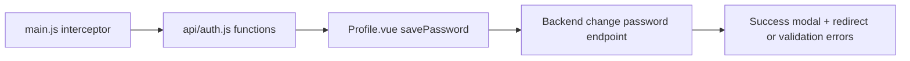
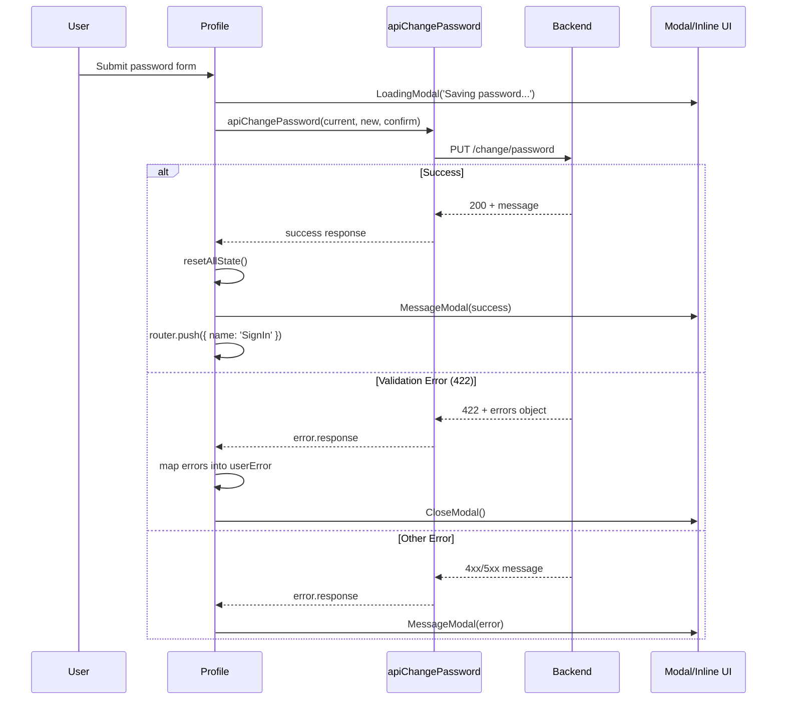

# Password Change Flow - Explained

This note explains how the password-change setup works at runtime: global auth header injection, API helper design, and Profile form submission/error handling.

## The Big Picture

The flow is split into three connected layers:

1. App bootstrap configures Axios to attach token headers automatically.
2. Auth API helpers define the exact backend requests.
3. Profile UI calls the helper, handles validation/server outcomes, and redirects on success.



---

## Step 1 - Edit: src/main.js (Explained)

### What it does at runtime
- `axios.interceptors.request.use(...)` runs for every Axios request before it is sent.
- It reads the current token from Pinia (`userStore.getSanctumToken()`) and injects `Authorization: Bearer ...` when missing.
- The route guard now calls `apiVerify()` directly and still updates/reset user state based on response success/failure.

### Why it is needed
- Without centralized header injection, every protected request must manually pass token headers, which is repetitive and error-prone.
- Interceptor-based injection guarantees a consistent auth header strategy across the app.

### How it connects to the next steps
- Step 2 can simplify `apiVerify()` because token handling is no longer a function argument concern.
- Step 3 benefits automatically, since `apiChangePassword()` will receive auth headers without custom header code.

```js
axios.interceptors.request.use((config) => {
    const token = userStore.getSanctumToken();
    if (token && !config.headers.Authorization) {
        config.headers.Authorization = `Bearer ${token}`;
    }
    return config;
});
```

---

## Step 2 - Edit: src/functions/api/auth.js (Explained)

### What it does at runtime
- `apiVerify()` issues `GET /verify` with Axios.
- `apiChangePassword(...)` issues `PUT /change/password` and sends all password fields in the request body.
- Because Step 1 interceptor runs first, both calls can be authenticated without explicitly attaching headers in these functions.

### Why it is needed
- API helper functions isolate backend endpoint details from UI components.
- Keeping request definitions in one module makes reuse and maintenance easier.

### How it connects to the other parts
- The route guard in `main.js` relies on `apiVerify()` to keep Pinia auth state valid.
- The Profile form in Step 3 calls `apiChangePassword(...)` directly, then reacts to its result.

| Function | HTTP | Endpoint | Used by |
| --- | --- | --- | --- |
| `apiVerify()` | GET | `/verify` | Route guard in `main.js` |
| `apiChangePassword(current_password, new_password, new_password_confirmation)` | PUT | `/change/password` | `savePassword()` in `Profile.vue` |

---

## Step 3 - Edit: src/components/auth/Profile.vue (Explained)

### What it does at runtime
- User submits the password form (`@submit.prevent="savePassword"`).
- `savePassword()` opens a loading modal, calls `apiChangePassword(...)`, and waits for response.
- On success:
  - Form and error state reset via `resetAllState()`.
  - Success modal appears.
  - Router redirects to `SignIn`.
- On error:
  - Network/no-response error -> generic error modal.
  - `422` validation error -> each backend field error is mapped into `userError` for inline messages.
  - Other server errors -> error modal with backend message.

### Why it is needed
- A real password-change UX must support three distinct states: loading, success, and recoverable validation failure.
- Inline field errors reduce user friction because users can correct input directly on the same form.

### How it connects to previous steps
- Uses `apiChangePassword` added in Step 2.
- Depends on Step 1 interceptor so authenticated headers are automatically included.



---

## Summary Flow

1. `main.js` configures Axios to inject Bearer token automatically.
2. `main.js` route guard calls `apiVerify()` to keep auth state synchronized.
3. `auth.js` provides `apiChangePassword(...)` as the password-update API wrapper.
4. `Profile.vue` submit handler calls `apiChangePassword(...)`.
5. UI branches by response type:
- success -> reset state, show success modal, redirect to SignIn.
- 422 -> map field errors and keep user on form.
- other error -> show generic/server error modal.
