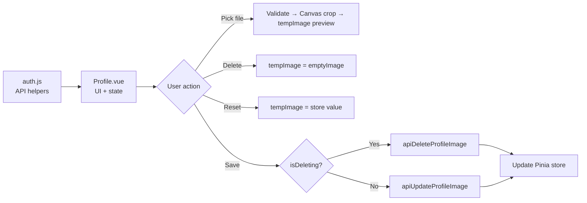
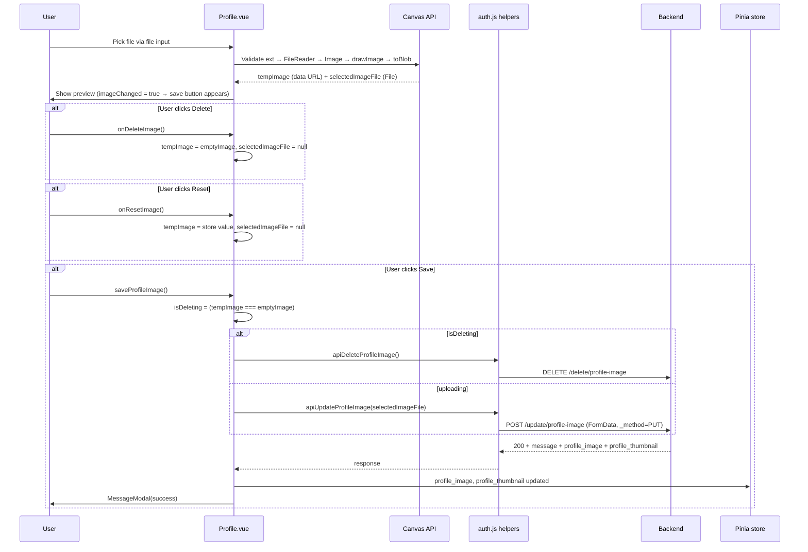

# Profile Image Upload — Explained

This note explains the runtime behavior and design decisions behind the profile image upload feature: multipart form data, Laravel method spoofing, client-side validation, the Canvas crop pipeline, reactive preview state, and the save/delete/reset control logic.

---

## The Big Picture

The feature is split into two layers that work together:



`tempImage` is the local working draft. The Pinia store holds the committed server value. Changes only reach the server when the user explicitly clicks the save button.

---

## Step 1 - Edit: src/functions/api/auth.js (Explained)

### What it does at runtime
- `apiUpdateProfileImage(image)` constructs a `FormData` object, appends the `File` and the `_method: PUT` field, then sends it as an HTTP `POST`.
- `apiDeleteProfileImage()` sends an HTTP `DELETE` with no body.
- The Axios interceptor registered in `main.js` (Session 3.1) automatically adds the Bearer token to both requests before they leave the browser.

### Why FormData instead of JSON for image upload
Axios sends `application/json` by default, which can only carry text. Binary file data (images, PDFs, etc.) must be transferred as `multipart/form-data` — the format `FormData` produces automatically when passed as the request body.

```js
const formData = new FormData();
formData.append('profile_image', image); // binary File
formData.append('_method', 'PUT');       // text field
return await axios.post(APP_API_URL + '/update/profile-image', formData);
```

### Why `_method: PUT` inside a POST request (Laravel method spoofing)

HTML forms and some older environments only support `GET` and `POST`. Laravel reads a `_method` field in the request body and treats the request as the specified HTTP verb. Sending `POST` with `_method=PUT` is the standard Laravel convention for `multipart/form-data` uploads that map to a `PUT` route.

| Approach | HTTP verb on wire | Laravel sees |
| --- | --- | --- |
| `axios.put(url, json)` | PUT | PUT — but can't carry `multipart/form-data` |
| `axios.post(url, formData)` + `_method: PUT` | POST | PUT — works with file uploads |

---

## Step 2 - Edit: src/components/auth/Profile.vue (Explained)

### The Big Picture for image state

```text
Pinia store: userStore.profile_image (committed server value)
         ↓ watch (immediate)
tempImage ref  ← local working draft shown in 
         ↑
onChangeImage: Canvas-processed data URL
onDeleteImage: emptyImage constant
onResetImage:  back to store value
         ↓ (only when imageChanged)
saveProfileImage → API → update store
```

### `tempImage` and `profileImage` — ref, computed, and watch

```js
const tempImage = ref(null);
const profileImage = computed(() => userStore.profile_image);
watch(
    () => profileImage.value,
    (nv) => (tempImage.value = nv ?? emptyImage),
    { immediate: true }
);
```

- `profileImage` is a `computed` wrapper around the store field so that `watch` can observe it reactively.
- `{ immediate: true }` makes the watcher run once right away on mount, seeding `tempImage` without a separate initialization line.
- `nv ?? emptyImage` — the nullish coalescing operator falls back to the placeholder when the user has no saved profile image.
- Because `tempImage` is independent of the store, editing the preview does not mutate Pinia state until `saveProfileImage` runs.

### `imageChanged` computed — the dirty flag

```js
const imageChanged = computed(
    () => tempImage.value !== (profileImage.value ?? emptyImage)
);
```

- Uses strict reference equality (`!==`). This is intentional: after a successful save, the store is updated with the server-returned URL, which makes `profileImage.value` match `tempImage.value` only if both are set to the same string — so the flag resets automatically.
- Drives `v-if="imageChanged"` on the save button to prevent users from submitting an unchanged form.

### Hidden file input + label trick

```vue
<input @change="onChangeImage" type="file" class="d-none" id="file-input" />
<label :for="'file-input'">
    <a type="button" class="m-1 btn btn-primary btn-sm">...</a>
</label>
```

- A `<label>` with a matching `for` attribute acts as a proxy click target for any form control, including `<input type="file">`.
- Hiding the native input removes the browser's default file-picker button, allowing a fully styled button to trigger the dialog instead.
- `event.target.value = null` at the end of `onChangeImage` resets the input, making it possible to re-select the same file after canceling.

### Client-side validation — extension check

```js
const extFile = files[0].name.split(".").pop()?.toLowerCase();
if (!allowedExtensions.includes(extFile)) {
    return MessageModal({ ... });
}
```

- The `:accept` attribute on the input suggests allowed types to the OS file picker but does not enforce them — a user can still bypass it. The JavaScript check is the real guard.
- `.pop()?.toLowerCase()` safely handles filenames with no extension (returns `undefined`, which `includes` won't match).

### Canvas crop and resize pipeline

```text
FileReader.readAsDataURL(file)
    → reader.onloadend → img.src = reader.result
    → img.onload → canvas operations
    → canvas.toBlob → new File([blob], "profile.png")
```

Each step is asynchronous and triggers the next:

| Step | API | Purpose |
| --- | --- | --- |
| `FileReader.readAsDataURL` | Web API | Read binary file into a base64 data URL |
| `new Image(); img.src = ...` | DOM API | Decode the data URL to get `naturalWidth`/`naturalHeight` |
| `Math.min(img.width, img.height)` | Math | Find the largest square fitting inside the image |
| `ctx.drawImage(img, x, y, size, size, 0, 0, 454, 454)` | Canvas 2D API | Crop center square and scale to 454×454 in one draw |
| `canvas.toBlob(cb, 'image/png')` | Canvas API | Export canvas pixels as a binary PNG Blob |
| `new File([blob], 'profile.png', ...)` | File API | Wrap Blob with a filename so FormData can send it |

The `canvas.toDataURL("image/png")` call produces the preview string assigned to `tempImage` — the same processed image the user will see before uploading.

### `saveProfileImage` — upload or delete decision

```js
const isDeleting = tempImage.value === emptyImage;
const response = isDeleting
    ? await apiDeleteProfileImage()
    : await apiUpdateProfileImage(selectedImageFile.value);
userStore.profile_image = isDeleting ? null : response.data.profile_image;
userStore.profile_thumbnail = isDeleting ? null : response.data.profile_thumbnail;
```

- `tempImage.value === emptyImage` uses strict reference equality against the imported constant. This is reliable because `onDeleteImage` sets `tempImage.value = emptyImage` (the exact same reference).
- After a successful call, both `profile_image` and `profile_thumbnail` in the store are updated directly. This makes any other component reading the store (e.g., a navbar avatar) re-render automatically without a page reload.
- `selectedImageFile.value = null` clears the staged file after upload so a subsequent reset goes back to the newly saved server URL rather than re-uploading stale data.

---

## Summary Flow


