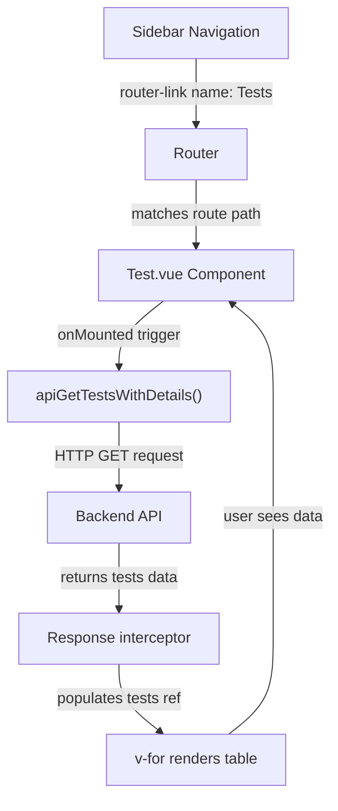

# Tests Management Page — Explained

This note explains how the Tests page works at runtime: the API module design, the Vue 3 Composition API lifecycle, reactive state binding to the data table, route configuration with layout slots, and the navigation system that connects everything together.

---

## The Big Picture

The Tests feature is a three-layer architecture:



The user clicks "Tests" in the sidebar. Vue Router navigates to the route by name. The component mounts. The `onMounted` hook fires. The API function is called. The response populates the reactive `tests` array. Vue's reactivity system triggers a re-render. The table appears with data.

---

## Step 1 - Create New: src/functions/api/test.js (Explained)

### What it does at runtime

The module exports six functions. When called, each function constructs an HTTP request using Axios:

- `apiGetTests()` → `GET /api/tests`
- `apiGetTestsWithDetails()` → `GET /api/tests/details` ← **Used in Test.vue**
- `apiCreateTest(data)` → `POST /api/tests/create`
- `apiReadTest(id)` → `GET /api/tests/read/{id}`
- `apiUpdateTest(data)` → `PUT /api/tests/update`
- `apiDeleteTest(id)` → `DELETE /api/tests/delete/{id}`

Each function returns a **Promise** — the Axios request object that resolves with the backend response.

### Why separate API files

The project organizes API functions by feature:
- `src/functions/api/auth.js` — authentication endpoints
- `src/functions/api/test.js` — test management endpoints

This keeps the page components clean. Instead of writing raw Axios calls inside components, they call descriptive helper functions. Easier to test, maintain, and reuse.

### Why `apiGetTestsWithDetails()` over `apiGetTests()`

The response includes nested objects:

```js
// apiGetTestsWithDetails() returns:
{
  tests: [
    {
      id: 1,
      name_kh: "ការប្រឡង",
      name_en: "Exam",
      short_name: "E1",
      creator: { name: "Admin" },      // related user
      created_at: "2026-01-15",
      updater: { name: "Staff" },      // related user
      updated_at: "2026-02-01"
    }
  ]
}
```

The template renders `{{ test.creator.name }}`. If the API only returned `creator_id` instead of the full `creator` object, the template would break. The "details" variant asks the backend to include the related user data — this is an optimization; the backend does a SQL join once instead of the frontend doing N+1 queries.

### How authentication is injected

Look back at the response structure in Session 3.1. The Axios interceptor was set up to attach the Bearer token:

```js
// This happens automatically in main.js (Session 3.1)
axios.interceptors.response.use(
  response => response,
  error => {
    if (error.response?.status === 401) {
      // Redirect to signin
    }
    return Promise.reject(error);
  }
);
```

When `apiGetTestsWithDetails()` returns an Axios promise, the interceptor has already injected `Authorization: Bearer {token}` into the headers. The backend receives the request with credentials already attached.

---

## Step 2 - Create New: src/components/pages/Test.vue (Explained)

### What `<script setup>` does at runtime

```js
<script setup>
import { ref, onMounted } from 'vue';
// ...
const tests = ref([]);

onMounted(async () => {
  // runs after DOM is ready
});
</script>
```

This is shorthand for the full Composition API. Equivalent to:

```js
export default {
  setup() {
    const tests = ref([]);
    onMounted(() => { });
    return { tests };
  }
}
```

The `<script setup>` version is more concise — all top-level variables are automatically exposed to the template.

### Reactive state: `ref([])` vs plain data

```js
const tests = ref([]);  // Reactive — changes trigger re-renders
const tests = [];       // Plain array — mutations do NOT trigger re-renders
```

When `generateTests()` runs:

```js
async function generateTests() {
  const response = await apiGetTestsWithDetails();
  tests.value = response.data.tests;  // .value unwraps the ref
}
```

The line `tests.value = response.data.tests` replaces the entire array. Because `tests` is a `ref`, Vue detects this change. Every template expression using `tests` re-evaluates. The `v-for` loop re-renders with the new data.

If `tests` were a plain array, the assignment would happen, but Vue would not know to re-render.

### Lifecycle sequence: onMounted → LoadingModal → API → CloseModal

```js
onMounted(async () => {
  try {
    LoadingModal();            // Show spinner
    await generateTests();     // Fetch data — blocks here
    return CloseModal();       // Close spinner, show table
  } catch (error) {
    return MessageModal({ icon: "error", title: "Error", ... });
  }
});
```

**Timeline:**
1. Component mounts → DOM is ready
2. `onMounted` fires → `LoadingModal()` displays SweetAlert spinner
3. `await generateTests()` pauses execution while HTTP request is in-flight
4. Response arrives → `tests.value` is populated → Vue marks component as "dirty"
5. `CloseModal()` dismisses the spinner
6. Vue re-renders → `v-for` creates table rows with test data
7. User sees the table

If the API call fails, the `catch` block runs → `MessageModal()` displays the error instead.

### Template reactivity: v-for with nested data

```vue
<tr v-for="test in tests" :key="test.id">
  <td>{{ test.name_kh }}</td>
  <td>{{ test.creator.name }}</td>
  <td>{{ test.updated_at }}</td>
</tr>
```

- `v-for="test in tests"` loops over the reactive `tests` array.
- `:key="test.id"` tells Vue to use `test.id` as the unique key — Vue uses this to track which row corresponds to which data object.
- `{{ test.creator.name }}` accesses the nested `creator` object. Because the backend provided the full object (not just `creator_id`), this works without extra queries.
- Each of the 6 data expressions (`test.name_kh`, `test.name_en`, etc.) is bound to the template — when `tests` changes, all of them are re-evaluated and the DOM updates.

### Error handling: try-catch with API fallback

```js
catch (error) {
  return MessageModal({
    icon: "error",
    title: "Error",
    text: error.response?.data?.message || error.message
  });
}
```

The `error.response?.data?.message` reads the backend error response (e.g., `"Test not found"`). If the response is missing, it falls back to the generic `error.message` (e.g., `"Network Error"`).

The optional chaining operator `?.` prevents crashes if `error.response` is `null` or `undefined`.

---

## Step 3 - Edit: src/router.js (Explained)

### Multiple named router-views in App.vue

The route config uses `components` (plural):

```js
{
    path: '/tests',
    name: 'Tests',
    components: {
        navbar: Navbar,
        sidebar: Sidebar,
        footer: Footer,
        default: Test,
    },
    meta: { guarded: true },
},
```

This maps to named `<router-view>` slots in `App.vue`:

```vue
<template>
  <router-view name="navbar" />
  <router-view name="sidebar" />
  <router-view name="default" />
  <router-view name="footer" />
</template>
```

When the user navigates to `/tests`:
- `<router-view name="navbar" />` renders the `Navbar` component
- `<router-view name="sidebar" />` renders the `Sidebar` component
- `<router-view name="default" />` renders the `Test` component (the page content)
- `<router-view name="footer" />` renders the `Footer` component

All four render in a single navigation. The layout is consistent across all pages.

### Route names vs paths: indirect navigation

```js
{ path: '/tests', name: 'Tests', ... }
```

The **path** is the URL: `/tests`  
The **name** is the semantic identifier: `'Tests'`

In the sidebar template:

```vue
<router-link :to="{ name: 'Tests' }">Tests</router-link>
```

Vue Router resolves the name `'Tests'` to the path `/tests` at runtime. This is indirect navigation. Benefits:
- If you rename the path to `/academics/tests`, only the route object changes — all links still work.
- The template intent is clear: "navigate to the Tests page" (by name) vs "go to URL /tests" (brittle).

### Route meta guards: lazy authentication

```js
{ path: '/tests', name: 'Tests', ..., meta: { guarded: true } },
```

The router guard was set up in Session 3.0:

```js
// In src/router.js (from Session 3.0)
router.beforeEach(async (to, from, next) => {
  if (to.meta.guarded && !isAuthenticated) {
    next({ name: 'SignIn' });
  } else {
    next();
  }
});
```

When a user tries to navigate to `/tests`:
1. Vue Router calls `beforeEach` guard.
2. Guard checks `to.meta.guarded` — it's `true`.
3. Guard checks `isAuthenticated` — if false, redirects to SignIn.
4. If authenticated, the navigation proceeds and `Test.vue` mounts.

This prevents unauthenticated users from viewing the Tests page.

---

## Step 4 - Edit: src/components/includes/Sidebar.vue (Explained)

### How `router-link` active-class works

```vue
<router-link :to="{ name: 'Tests' }" active-class="active" class="nav-link">
  <i class="nav-icon fas fa-vial"></i>
  <p>Tests</p>
</router-link>
```

**At runtime:**
- When the current route is NOT `Tests`: the `<a>` tag has class `nav-link` (no `active`)
- When the current route IS `Tests`: the `<a>` tag has class `nav-link active` (added automatically)

Vue Router compares the link's target route name with the current route name. If they match, it adds the `active-class` CSS class. The sidebar CSS uses `.active` to highlight (color, bold, background) the current link.

### Font Awesome icons

```vue
<i class="nav-icon fas fa-vial"></i>
```

This renders a Font Awesome test tube icon. The classes `fas fa-vial` are provided by the AdminLTE template included in the project. No Vue-specific logic here — it's just CSS and icon fonts.

### Nav menu sections and items

```vue
<li class="nav-header">
    Academic Management
</li>
<li class="nav-item">
    <router-link ...>Tests</router-link>
</li>
```

- `<li class="nav-header">` — a menu section header, styled by AdminLTE (usually darker, grouped label)
- `<li class="nav-item">` — a clickable menu item that contains a `router-link`

This creates a visual section "Academic Management" with a "Tests" link underneath. Future pages (like "Courses", "Assignments") would be added as more `<li class="nav-item">` entries under the same header.

---

## Summary Flow

Here's the complete sequence when a user clicks "Tests" in the sidebar:

```
1. User clicks router-link in Sidebar.vue
   ↓
2. router-link navigates by name: { name: 'Tests' }
   ↓
3. Vue Router matches name 'Tests' to path '/tests'
   ↓
4. beforeEach guard runs:
   - Checks meta.guarded = true
   - Verifies user is authenticated
   - Allows navigation to proceed
   ↓
5. Components render via named router-views:
   - Navbar, Sidebar, Footer load (unchanged)
   - Test.vue loads into the default view
   ↓
6. Test.vue mounts → onMounted hook fires
   ↓
7. LoadingModal() displays spinner
   ↓
8. apiGetTestsWithDetails() is called:
   - Axios creates HTTP GET request
   - Axios interceptor attaches Bearer token
   - Request sent to backend
   ↓
9. Backend processes request:
   - Queries tests table with JOIN on users
   - Returns JSON response with nested creator/updater objects
   ↓
10. Response arrives → tests.value = response.data.tests
    ↓
11. CloseModal() dismisses spinner
    ↓
12. Vue reactivity re-renders template:
    - v-for expands into 5-10 table rows
    - Each row displays test data + nested user names
    ↓
13. User sees the Tests page with table populated
```

Every piece connects: the sidebar link routes by name → the router guard protects it → the layout slots render the page → the lifecycle hook fetches data → reactive refs bind it to the template → the table displays it.
