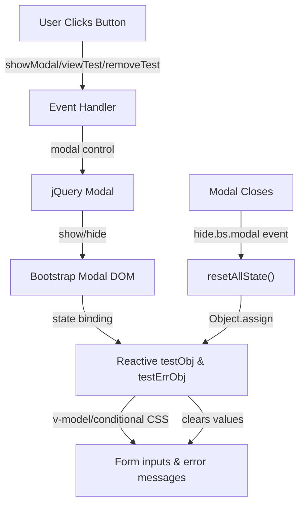

# Test Form Modal — Explained

This note explains how the form modal works at runtime: reactive state management with `reactive`, two-way form binding, CSS validation states, jQuery modal control, and the event flow from user clicks through modal open/close and state reset.

---

## The Big Picture

The Test modal feature is a four-layer system:



User clicks → Event fires → jQuery method called → Modal opens/closes → Reactive state updates → Template re-renders → User sees form with data or empty form.

---

## Step 1 - Run Command: Install jQuery (Explained)

### What it does at runtime

When you `npm install jquery@3.7.1`, the package is added to `node_modules/jquery/`. When you run `import $ from 'jquery'` in your Vue component, webpack bundles jQuery and makes it available as `$` in your code.

At runtime, `$('#TEST-MODAL')` is a jQuery selector that returns the modal DOM element. You can then call jQuery methods on it:
- `$('#TEST-MODAL').modal('show')` — opens the modal
- `$('#TEST-MODAL').modal('hide')` — closes the modal
- `$('#TEST-MODAL').on('hide.bs.modal', callback)` — listens for when Bootstrap closes the modal

### Why jQuery for modal control?

Bootstrap 4 modals are controlled via JavaScript. You have two options:

1. **jQuery** (classic, works with AdminLTE)
   ```js
   $('#TEST-MODAL').modal('show')
   ```

2. **Vanilla JavaScript** (modern, but verbose)
   ```js
   const modal = new bootstrap.Modal(document.getElementById('TEST-MODAL'))
   modal.show()
   ```

This project uses AdminLTE, which is built on jQuery. Using jQuery keeps the code consistent and simple.

---

## Step 2 - Run Command and Edit: Reactive Form State (Explained)

### `reactive` vs `ref` for form objects

Session 2.0 (bonus) introduced `ref` for single values:

```js
const count = ref(0)
count.value++  // must use .value in script
```

For grouped form data, `reactive` is cleaner:

```js
const testObj = reactive({
  id: null,
  name_en: "",
  name_kh: "",
  short_name: "",
})
testObj.name_en = "Biology"  // normal property access, no .value
```

**In templates, both are auto-unwrapped:**
```vue
<input v-model="testObj.name_en" />  <!-- no .value -->
```

### Two-way binding with v-model

```vue
<input v-model="testObj.name_kh" type="text" />
```

This creates a two-way bond:
- **User types in input** → Vue updates `testObj.name_kh`
- **Code changes `testObj.name_kh`** → Vue updates the input value on screen

Equivalent to:
```vue
<input 
  :value="testObj.name_kh" 
  @input="testObj.name_kh = $event.target.value"
  type="text" 
/>
```

### Why separate `testErrObj` for errors?

```js
const testObj = reactive({
  id: null,
  name_en: "",
  name_kh: "",
  short_name: "",
})
const testErrObj = reactive({
  name_en: "",
  name_kh: "",
  short_name: "",
})
```

When the user submits the form, the backend validates and responds with errors:

```json
{
  "errors": {
    "name_en": "Name (English) is required",
    "name_kh": "Name (Khmer) must be unique"
  }
}
```

Your code then populates `testErrObj`:
```js
Object.assign(testErrObj, response.data.errors)
// Now testErrObj = {
//   name_en: "Name (English) is required",
//   name_kh: "Name (Khmer) must be unique",
//   short_name: ""
// }
```

The template shows errors only when they exist:
```vue
<div class="invalid-feedback">
  {{ testErrObj.name_kh }}  <!-- displays error or empty string -->
</div>
```

### Default state snapshots for clean resets

```js
const defaultTestObj = JSON.parse(JSON.stringify(testObj))
const defaultTestErrObj = JSON.parse(JSON.stringify(testErrObj))
```

`JSON.parse(JSON.stringify(obj))` is a deep copy. It creates a completely independent snapshot. Without this, all variables would reference the same object:

```js
// ❌ Wrong: all point to the same object
const testObj = reactive({ name_en: "" })
const defaultTestObj = testObj  // same object!

// Change one, all change
testObj.name_en = "Biology"
console.log(defaultTestObj.name_en)  // "Biology" — oops!
```

```js
// ✅ Correct: deep copy is independent
const testObj = reactive({ name_en: "" })
const defaultTestObj = JSON.parse(JSON.stringify(testObj))  // new object

testObj.name_en = "Biology"
console.log(defaultTestObj.name_en)  // "" — unchanged
```

### Form reset logic

```js
function resetAllState() {
  Object.assign(testObj, defaultTestObj)
  Object.assign(testErrObj, defaultTestErrObj)
}
```

`Object.assign(target, source)` copies all properties from `source` into `target`. This updates the reactive object **in-place** without replacing it (important for Vue reactivity).

When the modal closes:
```js
$('#TEST-MODAL').on('hide.bs.modal', function () {
  resetAllState()  // Clears form for next use
})
```

The Bootstrap `hide.bs.modal` event fires **after** the user clicks Cancel or the Save button. This ensures the form is blank when the user opens the modal again.

---

## Template Conditional CSS Classes (Explained)

### `:class` binding for validation states

```vue
<input 
  v-model="testObj.name_kh" 
  type="text" 
  class="form-control"
  :class="{ 'is-invalid': !!testErrObj.name_kh }"
/>
```

- `class="form-control"` — always present (Bootstrap base style).
- `:class="{ 'is-invalid': !!testErrObj.name_kh }"` — adds `is-invalid` CSS class **only if** `testErrObj.name_kh` is not empty.
- `!!testErrObj.name_kh` — double bang converts to boolean (`"error message"` → `true`, `""` → `false`).

When `testErrObj.name_kh` is a non-empty string, the input gets a red border (Bootstrap's `.is-invalid` style). When empty, no extra class is added.

### Error message display

```vue
<div class="invalid-feedback">
  {{ testErrObj.name_kh }}
</div>
```

This `<div>` is always in the DOM. When `testErrObj.name_kh` is empty, it renders an empty string (invisible). When populated with an error message, it displays the message in small red text below the input (Bootstrap `.invalid-feedback` style).

---

## Form Submission and Event Handlers (Explained)

### Form submit with `.prevent`

```vue
<form @submit.prevent="saveTest()">
```

- `@submit` — fires when user clicks the Submit button or presses Enter in an input.
- `.prevent` — event modifier that calls `event.preventDefault()` to block the default page reload.
- `"saveTest()"` — your handler function is called.

Without `.prevent`, the form would POST to the server and reload the page (old HTML behavior).

### Button click handlers

```vue
<button class="btn btn-sm btn-primary" @click="showModal()">Add</button>
```

When clicked, `showModal()` is called immediately (not a form submit).

### Modal control functions

```js
function hideModal() {
  $('#TEST-MODAL').modal('hide')
}
function showModal() {
  $('#TEST-MODAL').modal('show')
}
```

These wrap jQuery modal methods. By creating functions, you have a single place to change the modal logic if needed.

### Action button handlers

```js
async function viewTest(id) {
  showModal()
}
async function removeTest(id) {
  Swal.fire({
    title: 'Want to delete the test ?',
    ...
  }).then(async (sw) => {
    if (sw.isConfirmed) {
      // Delete API call goes here (not yet implemented)
    }
  })
}
```

- `viewTest(id)` — opens modal and will load test data (skeleton for next session).
- `removeTest(id)` — shows a delete confirmation dialog using SweetAlert2.
- `Swal.fire({...}).then(...)` — returns a Promise that resolves after user makes a choice (Confirm or Cancel).
- `if (sw.isConfirmed)` — check if user clicked "Yes, Delete it."

---

## jQuery Event Listeners in onMounted (Explained)

### Setting up the hide event listener

```js
onMounted(async () => {
  $('#TEST-MODAL').on('hide.bs.modal', function () {
    resetAllState()
  })
  // ... fetch data
})
```

When the component first mounts, you register a listener on the modal's `hide.bs.modal` event. This event fires whenever Bootstrap closes the modal (either user clicks Cancel, Save, or the X button).

Every time the event fires, `resetAllState()` runs, clearing `testObj` and `testErrObj`.

### Why not in a lifecycle hook?

You might think to use an `onUpdated` or `onBeforeUnmount` hook, but:
- `onUpdated` runs on **every re-render** — expensive if used for modal cleanup.
- `onBeforeUnmount` runs when the **entire component unmounts** — you want to reset the form each time the modal closes, not just when leaving the page.
- jQuery's `.on()` event listener is specific to the modal's lifecycle — it fires exactly when needed.

---

## Runtime Sequence: User Opens Modal and Edits

```
1. User clicks "Add" button
   ↓
2. @click="showModal()" fires
   ↓
3. showModal() calls $('#TEST-MODAL').modal('show')
   ↓
4. Bootstrap CSS animates modal fade-in
   ↓
5. Modal appears on screen with form inputs
   ↓
6. User types in "Name (English)" input
   ↓
7. v-model listener detects change
   ↓
8. testObj.name_en updates to user's text
   ↓
9. Vue re-renders template
   ↓
10. Input :value binding shows updated text
    ↓
11. User clicks "Cancel"
    ↓
12. @click="hideModal()" fires
    ↓
13. hideModal() calls $('#TEST-MODAL').modal('hide')
    ↓
14. Bootstrap CSS animates modal fade-out
    ↓
15. hide.bs.modal event fires (jQuery listener)
    ↓
16. resetAllState() runs:
    - Object.assign(testObj, defaultTestObj)
    - Object.assign(testErrObj, defaultTestErrObj)
    ↓
17. testObj becomes { id: null, name_en: "", name_kh: "", short_name: "" }
    ↓
18. Vue re-renders template
    ↓
19. Form inputs are now empty
    ↓
20. Next time user opens modal, they see a blank form
```

---

## Summary Flow

1. **Install jQuery** → Enables jQuery modal control methods.
2. **Add reactive objects** → `testObj` for form data, `testErrObj` for validation errors.
3. **Create modal HTML** → Bootstrap modal with v-model inputs and error messages.
4. **Bind event handlers** → `@click` on buttons, `@submit` on form.
5. **Add modal functions** → `showModal()` and `hideModal()` wrap jQuery calls.
6. **Register cleanup listener** → jQuery event listener resets form when modal closes.
7. **User clicks button** → Handler opens/closes modal via jQuery.
8. **Modal visibility changes** → jQuery event fires, `resetAllState()` clears form.
9. **Ready for next action** → User sees fresh form, ready to create/edit another test.
