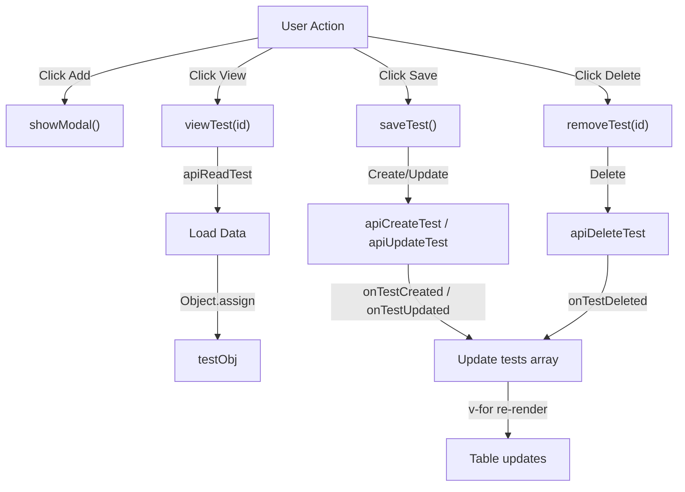

# Full CRUD API Operations — Explained

This note explains how the CRUD implementation works at runtime: the API integration flow for create/read/update/delete, validation error handling with 422 responses, reactive state synchronization, and the distinction between form mode (add vs edit) based on `testObj.id`.

---

## The Big Picture

The CRUD system is a bidirectional sync between form, server, and table:



Each operation follows this pattern: **User action** → **API call** → **Response** → **Update reactive array** → **Table re-renders**.

---

## Step 1 - Edit: Import Additional API Functions (Explained)

### What it does at runtime

The import statement loads the five API functions from `@/functions/api/test.js`:

```js
import { 
  apiGetTestsWithDetails,   // ← Already used in onMounted
  apiCreateTest,            // ← Now used in saveTest() for new records
  apiReadTest,              // ← Now used in viewTest() for loading
  apiUpdateTest,            // ← Now used in saveTest() for edits
  apiDeleteTest             // ← Now used in removeTest()
} from '@/functions/api/test';
```

Each function returns a Promise that resolves to an Axios response object with `data` field containing the server response.

### Why import them all at once

Importing multiple functions from the same module is more efficient than multiple import statements:

```js
// ❌ Verbose — multiple imports
import { apiCreateTest } from '@/functions/api/test'
import { apiUpdateTest } from '@/functions/api/test'
import { apiDeleteTest } from '@/functions/api/test'

// ✅ Clean — single import
import { apiCreateTest, apiUpdateTest, apiDeleteTest } from '@/functions/api/test'
```

---

## Step 2 - Edit: Implement saveTest() (Explained)

### Create vs Update: testObj.id as mode indicator

```js
if (testObj.id === null) {
  response = await apiCreateTest(testObj);
  onTestCreated(response.data.test);
} else {
  response = await apiUpdateTest(testObj);
  onTestUpdated(response.data.test);
}
```

The form enters two modes based on whether `testObj.id` has a value:

| Mode | testObj.id | Action | Example |
|------|-----------|--------|---------|
| **Create** | `null` | User clicks "Add", form opens empty | `{ id: null, name_en: "", ... }` |
| **Edit** | `5` (number) | User clicks "View", form loads data | `{ id: 5, name_en: "Biology", ... }` |

When `saveTest()` runs, it checks this value to decide which API function to call.

### Try-catch: Network errors vs server errors

```js
try {
  // API call happens here
  response = await apiCreateTest(testObj)
} catch (error) {
  const { response } = error  // destructure response from error
  if (!response) {
    // No response = network error (offline, timeout, DNS fail)
    return MessageModal({ icon: "error", title: "Error", text: error.message })
  }
  // Has response = server responded with error
}
```

**Network Error (no response):**
- User is offline
- Server is unreachable
- Request timed out
- `error.response` is `undefined`
- `error.message` contains generic message like "Network Error"

**Server Error (has response):**
- Backend processed the request but rejected it
- `error.response.status` is the HTTP status code (422, 400, 500, etc.)
- `error.response.data` contains server's error details

### Validation Errors: 422 Status

```js
const { status, data } = response
if (status === 422) {
  Object.keys(testErrObj).forEach((key) => {
    testErrObj[key] = data.errors[key]
      ? data.errors[key][0]
      : ""
  })
  return CloseModal()
}
```

HTTP 422 is "Unprocessable Entity" — the server rejected the request because validation failed. Laravel (the backend framework) responds with:

```json
{
  "message": "The given data was invalid.",
  "errors": {
    "name_en": ["Name (English) is required"],
    "name_kh": ["Name (Khmer) must be unique"],
    "short_name": []
  }
}
```

The error handler:
1. Loops through each field in `testErrObj`.
2. If server returned errors for this field, takes the **first error message** `[key][0]`.
3. If no errors, sets to empty string (removes any previous error).
4. Keeps modal open — user sees red error borders and messages, can fix and retry.

### Success Response

```js
hideModal()
return MessageModal({ icon: 'success', title: 'Success', text: response.data.message })
```

After successful create/update:
- `hideModal()` closes the form.
- `response.data.message` is something like "Test created successfully."
- `MessageModal()` shows this success notification.

---

## Step 3 - Edit: Implement viewTest() (Explained)

### Load existing data into form

```js
async function viewTest(id) {
  try {
    LoadingModal()
    const response = await apiReadTest(id)
    Object.assign(testObj, response.data.test)
    showModal()
    return CloseModal()
  } catch (error) { /* ... */ }
}
```

**Sequence:**
1. Show loading spinner.
2. Call `apiReadTest(id)` — API returns full test object with all fields.
3. `Object.assign(testObj, response.data.test)` — copy server data into reactive form object.
4. `showModal()` — display modal with form now pre-filled.
5. `CloseModal()` — hide spinner, user sees form with data.

### Object.assign for reactive updates

```js
const testObj = reactive({ id: null, name_en: "", name_kh: "", short_name: "" })

// ✅ Correct — Object.assign updates properties in-place
Object.assign(testObj, { id: 5, name_en: "Biology", name_kh: "ជីววិទ្យា", short_name: "BIO" })

// ❌ Wrong — replaces entire object, breaks reactivity
testObj = { id: 5, name_en: "Biology", ... }  // Loses reactive binding!
```

`Object.assign()` modifies the existing reactive object, so all v-model bindings and computed properties remain connected. If you replace the object entirely, Vue loses track of the reference.

### Form now in Edit Mode

After `Object.assign()` completes:
- `testObj.id` is now `5` (not null).
- Next time user clicks Save, the `if (testObj.id === null)` check will be false.
- `apiUpdateTest(testObj)` will be called instead of `apiCreateTest()`.

---

## Step 4 - Edit: Implement removeTest() (Explained)

### SweetAlert Promise chain

```js
Swal.fire({ ... }).then(async (sw) => {
  if (sw.isConfirmed) {
    // Delete API call
  }
})
```

`Swal.fire()` returns a Promise that resolves when the user makes a choice:
- If user clicks "Yes, Delete it." → `sw.isConfirmed` is `true`
- If user clicks Cancel → `sw.isConfirmed` is `false`

The `.then()` handler only deletes if user confirmed.

### Delete API call

```js
if (sw.isConfirmed) {
  try {
    LoadingModal()
    const response = await apiDeleteTest(id)
    onTestDeleted(response.data.test)
    return MessageModal({ icon: 'success', title: 'Success', text: response.data.message })
  } catch (error) {
    return MessageModal({ icon: "error", title: "Error", text: error.response?.data?.message || error.message })
  }
}
```

- `apiDeleteTest(id)` sends DELETE request to backend.
- Backend deletes the record from database and returns the deleted test object.
- `onTestDeleted()` removes it from reactive `tests` array.
- Success message confirms deletion to user.

---

## Step 5 - Edit: Helper Functions for Array Updates (Explained)

### Why separate helper functions?

Instead of inline code, extracting these into functions makes the main handlers (`saveTest`, `viewTest`, `removeTest`) cleaner and more readable:

```js
// ❌ Harder to follow
if (testObj.id === null) {
  response = await apiCreateTest(testObj)
  tests.value = [...tests.value, response.data.test]  // Create inline
} else {
  response = await apiUpdateTest(testObj)
  tests.value = tests.value.map(obj => obj.id !== response.data.test.id ? obj : response.data.test)  // Update inline
}

// ✅ Clearer intent
if (testObj.id === null) {
  response = await apiCreateTest(testObj)
  onTestCreated(response.data.test)
} else {
  response = await apiUpdateTest(testObj)
  onTestUpdated(response.data.test)
}
```

### Create: Append to array

```js
const onTestCreated = (test) => {
  tests.value = [...tests.value, test]
}
```

The spread operator `...` unpacks the existing array, then adds the new test to the end. This creates a **new array reference**, which triggers Vue's reactivity:

```js
// ❌ Mutation — Vue doesn't detect change
tests.value.push(test)

// ✅ Assignment — Vue detects change
tests.value = [...tests.value, test]
```

### Update: Replace matching item

```js
const onTestUpdated = (test) => {
  tests.value = tests.value.map(obj => obj.id !== test.id ? obj : test)
}
```

`.map()` transforms the array. For each item:
- If `obj.id !== test.id` (doesn't match) → keep the old `obj`
- If `obj.id === test.id` (matches) → replace with new `test`

Result: one item is updated, all others stay the same. New array reference triggers reactivity.

### Delete: Filter out matching item

```js
const onTestDeleted = (test) => {
  tests.value = tests.value.filter(obj => obj.id !== test.id)
}
```

`.filter()` keeps only items where the condition is true. Since the condition is `obj.id !== test.id`, the deleted item (where `obj.id === test.id`) is removed. New array reference triggers reactivity.

### Reactivity Trigger: New Array Reference

All three functions create a **new array**:

```js
// ❌ No reactivity — same array reference
tests.value.push(test)

// ✅ Reactivity — new array reference
tests.value = [...tests.value, test]
tests.value = tests.value.map(...)
tests.value = tests.value.filter(...)
```

Vue's reactivity system watches for reference changes. When `tests.value = newArray`, Vue detects the change and re-renders the v-for loop in the template.

---

## Form Mode: Create vs Edit

### Create Flow

```
1. User clicks "Add" button
   ↓
2. showModal() opens empty form
   ↓
3. testObj = { id: null, name_en: "", name_kh: "", short_name: "" }
   ↓
4. User types values
   ↓
5. User clicks Save
   ↓
6. saveTest() checks: testObj.id === null? YES
   ↓
7. Call apiCreateTest(testObj)
   ↓
8. Backend returns: { id: 7, name_en: "...", ... }
   ↓
9. onTestCreated() adds to tests array
   ↓
10. Table re-renders with new row
```

### Edit Flow

```
1. User clicks "View" button on row with id=5
   ↓
2. viewTest(5) called
   ↓
3. apiReadTest(5) fetches: { id: 5, name_en: "Biology", ... }
   ↓
4. Object.assign(testObj, fetched data)
   ↓
5. testObj.id now = 5 (no longer null!)
   ↓
6. showModal() opens form WITH DATA PRE-FILLED
   ↓
7. User edits values
   ↓
8. User clicks Save
   ↓
9. saveTest() checks: testObj.id === null? NO
   ↓
10. Call apiUpdateTest(testObj with id=5)
    ↓
11. Backend updates record, returns updated object
    ↓
12. onTestUpdated() replaces item in tests array
    ↓
13. Table row updates with new values
```

---

## Error Scenarios

### Network Error

```js
// User is offline or server unreachable
try {
  response = await apiCreateTest(testObj)
} catch (error) {
  if (!error.response) {
    // No response from server
    MessageModal({ icon: "error", title: "Error", text: "Network Error" })
  }
}
```

### Validation Error (422)

```js
// Backend validation failed
// Response: { status: 422, data: { errors: { name_en: ["Required"] } } }

if (status === 422) {
  Object.keys(testErrObj).forEach((key) => {
    testErrObj[key] = data.errors[key] ? data.errors[key][0] : ""
  })
  CloseModal()  // Keep modal open
}
// Form shows red borders and error messages under inputs
```

### Server Error (500)

```js
// Backend error or unhandled exception
// Response: { status: 500, data: { message: "Internal Server Error" } }

return MessageModal({ icon: "error", title: "Error", text: data.message })
// Modal closes, error is shown
```

---

## Summary Flow: Complete CRUD Cycle

```
START: Page loads
  ↓
1. onMounted() calls generateTests()
  ↓
2. apiGetTestsWithDetails() fetches all tests
  ↓
3. tests.value populated, v-for renders table
  ↓
USER CLICKS "Add"
  ↓
4. showModal() opens form with empty testObj
  ↓
5. User types values into inputs (v-model updates testObj)
  ↓
6. User clicks "Save"
  ↓
7. saveTest() called
  ↓
8. testObj.id === null? YES → apiCreateTest(testObj)
  ↓
9. Backend validates, creates, returns new test with id
  ↓
10. onTestCreated() adds to tests.value
  ↓
11. v-for re-renders, new row appears in table
  ↓
12. Modal closes, success message shows
  ↓
---
USER CLICKS "View" on row with id=5
  ↓
13. viewTest(5) called
  ↓
14. apiReadTest(5) fetches that specific test
  ↓
15. Object.assign() copies data into testObj
  ↓
16. testObj.id = 5, form shows data
  ↓
17. showModal() opens form with data
  ↓
18. User edits fields
  ↓
19. User clicks "Save"
  ↓
20. saveTest() called
  ↓
21. testObj.id === null? NO → apiUpdateTest(testObj)
  ↓
22. Backend validates, updates, returns updated test
  ↓
23. onTestUpdated() replaces item in tests.value
  ↓
24. v-for re-renders, row updates with new values
  ↓
25. Modal closes, success message shows
  ↓
---
USER CLICKS "Delete" on row with id=5
  ↓
26. removeTest(5) called
  ↓
27. SweetAlert shows confirmation dialog
  ↓
28. User clicks "Yes, Delete it."
  ↓
29. apiDeleteTest(5) sends DELETE request
  ↓
30. Backend deletes record from database
  ↓
31. onTestDeleted() removes from tests.value
  ↓
32. v-for re-renders, row disappears from table
  ↓
33. Success message shows "Test deleted"
  ↓
END: Table fully synced with backend
```

Every CRUD operation follows this same flow: **User action** → **API call** → **Helper function updates reactive array** → **v-for auto re-renders table**.
