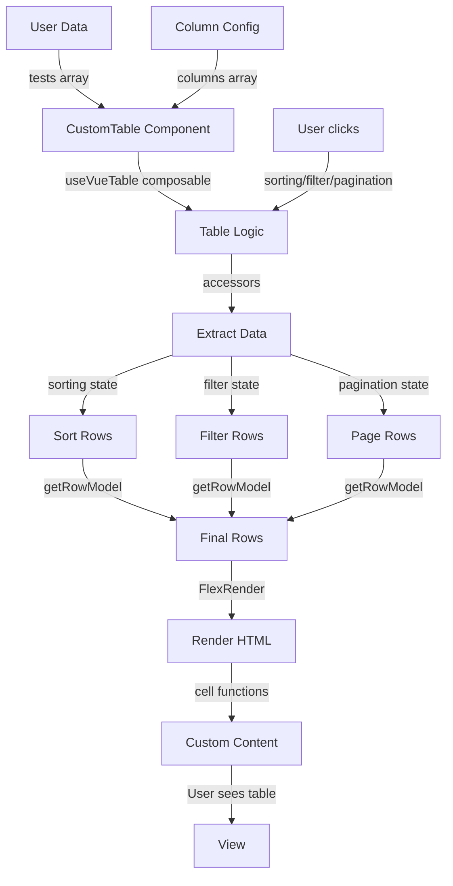

# Advanced Data Tables with TanStack Vue Table — Explained

This note explains how the TanStack Vue Table library works at runtime: the headless UI architecture, composable pattern, column configuration system, data accessors, cell rendering with the `h` function, and how table features (sorting, filtering, pagination) are managed through reactive state.

---

## The Big Picture

TanStack Vue Table separates concerns into layers:



The library handles all the complex logic (sorting, filtering, pagination state management). You just provide data and configuration. Vue's reactivity keeps everything in sync.

---

## Step 1 - Run Command: Install TanStack Vue Table (Explained)

### What it does at runtime

When you install `@tanstack/vue-table`, you get access to several functions and components:

```js
import {
  useVueTable,          // Main composable that manages table state
  FlexRender,           // Component that renders dynamic template functions
  getCoreRowModel,      // Function that handles basic row operations
  getPaginationRowModel, // Function that handles page slicing
  getSortedRowModel,    // Function that handles sorting rows
  getFilteredRowModel,  // Function that handles global filtering
} from "@tanstack/vue-table"
```

These are imported into CustomTable.vue and work together to manage all table operations.

### Why "headless" UI?

TanStack Vue Table is called "headless" because it provides **logic but no styling**. It doesn't give you a pre-built table component. Instead, it gives you tools to build your own table component with the styling and HTML structure you choose.

```js
// ❌ Not headless — pre-built table with locked styling
import { MyTable } from 'some-ui-library'
<MyTable :data="data" />  // Limited customization

// ✅ Headless — you build the table, library manages logic
import { useVueTable } from '@tanstack/vue-table'
const table = useVueTable({ ... })
// Now you write <table><thead><tbody> yourself with full control
```

---

## Step 2 - Create New: CustomTable.vue (Explained)

### useVueTable composable

```js
const table = computed(() =>
  useVueTable({
    data: props.data,
    columns: columns.value,
    getCoreRowModel: getCoreRowModel(),
    getPaginationRowModel: getPaginationRowModel(),
    getSortedRowModel: getSortedRowModel(),
    getFilteredRowModel: getFilteredRowModel(),
    state: { ... },
    onSortingChange: (updaterOrValue) => { ... }
  })
);
```

`useVueTable()` returns an object with methods:
- `table.getHeaderGroups()` — returns header structure for rendering.
- `table.getRowModel().rows` — returns filtered, sorted, paginated rows.
- `table.nextPage()`, `table.previousPage()` — page navigation.
- `table.getState()` — current sorting, filtering, pagination state.
- `table.getPageCount()` — total number of pages.

Everything is computed, so it re-runs when `data`, `sorting`, or `filter` changes. Vue's reactivity system orchestrates the updates.

### Row model functions

```js
getCoreRowModel: getCoreRowModel(),
getPaginationRowModel: getPaginationRowModel(),
getSortedRowModel: getSortedRowModel(),
getFilteredRowModel: getFilteredRowModel(),
```

These four functions are chained — they transform rows step by step:

```
Raw Data
  ↓
getCoreRowModel — basic row operations
  ↓
getFilteredRowModel — apply global filter (search)
  ↓
getSortedRowModel — apply sorting
  ↓
getPaginationRowModel — slice to current page
  ↓
Final Rows for Display
```

Each function receives the previous rows and the current state, then returns transformed rows.

### Reactive state binding

```js
const sorting = ref([])
const filter = ref("")

const table = computed(() =>
  useVueTable({
    state: {
      get sorting() {
        return sorting.value
      },
      get globalFilter() {
        return replaceUnicode(filter.value)
      },
    },
    onSortingChange: (updaterOrValue) => {
      sorting.value =
        typeof updaterOrValue === "function"
          ? updaterOrValue(sorting.value)
          : updaterOrValue
    },
  })
)
```

When user clicks a header to sort:
1. TanStack detects the click and calls `onSortingChange`.
2. `sorting.value` is updated with new sort direction.
3. Since `table` is `computed` and depends on `sorting.value`, the computed re-runs.
4. `useVueTable()` is called again with the new sort state.
5. `getSortedRowModel()` sorts the rows differently.
6. `table.getRowModel().rows` now returns sorted rows.
7. Template re-renders with new row order.

### Khmer text normalization

```js
function replaceUnicode(text) {
  const salabpi = ["ង", "ញ", "ប", "ម", "យ", "រ", "វ"]
  const treysab = ["ស", "ហ", "អ"]
  // ... replaces Khmer diacritics to standard form
}

state: {
  get globalFilter() {
    return replaceUnicode(filter.value)
  }
}
```

Khmer script has multiple ways to represent the same letter (with different diacritical marks). If a user types "សៃ" and the data has "សៈ", they appear different but sound identical. `replaceUnicode()` normalizes both to the same canonical form so filtering works correctly.

### Pagination state management

```js
const currentPage = ref(0)
const pageSize = ref(props.pageSize)

onBeforeUpdate(() => {
  if (filter.value !== "") {
    // User is searching
    if (!showedPage.value) {
      showedPage.value = table.value.getState().pagination.pageIndex
      // Remember which page user was on before filtering
    }
    // Reset to page 0 when search results change
    if (table.value.getPageCount() <= currentPage.value) {
      currentPage.value = 0
    }
  } else {
    // User cleared the search
    if (showedPage.value && showedPage.value !== currentPage.value) {
      currentPage.value = showedPage.value
      // Go back to the page they were on before filtering
      showedPage.value = null
    }
  }
  columns.value = [...props.columns]
})
```

This logic preserves the user's position when they search:
- If user is on page 3 and types a search, reset to page 0 (filtered results).
- If user clears the search, go back to page 3 (their original position).

---

## Step 3 - Edit: Column Configuration in Test.vue (Explained)

### Simple accessor column

```js
{
  accessorKey: 'name_kh',
  header: 'Name (Khmer)',
}
```

TanStack looks at the data:
```js
row.original = { name_kh: "ការប្រឡង", name_en: "Exam", ... }
```

For this column:
- **Accessor**: reads `row.original.name_kh`
- **Header**: displays "Name (Khmer)"
- **Cell**: automatically displays the value

No custom rendering needed — the default is just text.

### Complex accessor column with custom cell

```js
{
  accessorFn: ({ creator, created_at }) => creator.name + created_at,
  header: 'Created By',
  cell: ({ row }) => [
    h('div', row.original.created_at),
    h('div', row.original.creator.name)
  ],
}
```

The data structure:
```js
row.original = {
  creator: { name: "Admin" },
  created_at: "2026-01-15",
  ...
}
```

**accessorFn**: Instead of a simple key, use a function to extract/compute data. Here it concatenates `creator.name + created_at` for sorting/filtering to work across both fields.

**cell**: Renders the cell as an array of Vue elements:
```js
[
  h('div', row.original.created_at),      // First line: date
  h('div', row.original.creator.name)     // Second line: creator name
]
```

### Header with button

```js
{
  accessorKey: 'action',
  header: () => [
    'Actions',
    h('button',
      {
        onClick: () => showModal(),
        class: 'btn btn-sm btn-success ml-3'
      },
      'Create New'
    )
  ],
  // ...
}
```

`header` can be a **function** that returns Vue elements. Here:
- First element: text "Actions"
- Second element: a button that calls `showModal()` when clicked

The button appears in the column header (top-right of table).

### Action column with cell rendering

```js
{
  accessorKey: 'action',
  cell: ({ row }) => [
    h('button',
      {
        onClick: () => removeTest(row.original.id),
        class: 'btn btn-sm btn-outline-danger mx-1'
      },
      h('i', { class: 'fa fa-trash' })
    ),
    h('button',
      {
        onClick: () => viewTest(row.original.id),
        class: 'btn btn-sm btn-secondary mx-1'
      },
      h('i', { class: 'fa fa-eye' })
    ),
  ],
  enableSorting: false,
  enableGlobalFilter: false,
}
```

**cell** function receives `{ row }`:
- `row.original.id` — the ID of this test.
- `row.original` — all data for this row.

Renders two buttons:
1. Delete button (trash icon) — calls `removeTest(row.original.id)`.
2. View button (eye icon) — calls `viewTest(row.original.id)`.

**enableSorting: false** — this column doesn't participate in sorting.
**enableGlobalFilter: false** — this column is not searchable.

### The `h` function (hyperscript)

```js
h('button',
  { onClick: () => showModal(), class: 'btn btn-sm btn-success' },
  'Create New'
)
```

`h(tag, props, children)` creates a Vue element programmatically:
- `tag` — HTML tag name: `'button'`, `'div'`, `'i'`, etc.
- `props` — object with attributes and event handlers: `{ class: '...', onClick: ..., disabled: true }`.
- `children` — content: text, arrays, or nested `h()` calls.

Equivalent to:
```vue
<button @click="showModal()" class="btn btn-sm btn-success">Create New</button>
```

With `h()`, you can generate HTML dynamically from data and configuration.

---

## Step 4 - Edit: Replace Manual Table with CustomTable Component (Explained)

### Before: 30 lines of manual HTML

```vue
<table class="table table-bordered table-striped">
  <thead>
    <tr>
      <th>Name (Khmer)</th>
      <th>Name (English)</th>
      <!-- ... 8 more columns -->
    </tr>
  </thead>
  <tbody>
    <tr v-for="test in tests" :key="test.id">
      <td>{{ test.name_kh }}</td>
      <td>{{ test.name_en }}</td>
      <!-- ... 8 more columns -->
      <td>
        <button @click="viewTest(test.id)">View</button>
        <button @click="removeTest(test.id)">Delete</button>
      </td>
    </tr>
  </tbody>
</table>
```

This manual table:
- No sorting (headers don't respond to clicks).
- No filtering (no search box).
- No pagination (shows all rows, page gets long).
- No state preservation (scrolls to top on filter).

### After: 1 line of component

```vue
<CustomTable :title="'Test List'" :data="tests" :columns="columns" />
```

CustomTable provides:
- ✅ Sorting (click headers, arrows appear).
- ✅ Filtering (search box with Khmer support).
- ✅ Pagination (50+ rows split into pages).
- ✅ Smart state (remembers page when filtering, restores it when clearing).

### Props interface

**:title** — String for the card header.  
**:data** — Array of objects (the `tests` ref).  
**:columns** — Array of column configuration objects.

Props are reactive — if `tests` array changes, the table updates automatically.

---

## FlexRender Component

```vue
<FlexRender :render="header.column.columnDef.header" :props="header.getContext()" />
<FlexRender :render="cell.column.columnDef.cell" :props="cell.getContext()" />
```

`<FlexRender>` is a TanStack utility component. It takes a render function and props, and executes the render function with those props.

**For headers**:
- If `header` is a string ("Name (Khmer)") — renders text.
- If `header` is a function — calls it and renders the result.

**For cells**:
- If `cell` is undefined — renders the raw value from the accessor.
- If `cell` is a function — calls it with `{ row }` and renders the result.

This allows the same column config to work for simple text cells or complex Vue elements.

---

## Sorting Flow

```
1. User clicks "Name (English)" header
   ↓
2. @click handler calls header.column.getToggleSortingHandler()
   ↓
3. TanStack detects "ascending" sort is needed
   ↓
4. onSortingChange called with [{id: 'name_en', desc: false}]
   ↓
5. sorting.value = [{id: 'name_en', desc: false}]
   ↓
6. table computed re-runs because sorting.value changed
   ↓
7. getSortedRowModel() sorts all rows by name_en field
   ↓
8. table.getRowModel().rows now in sorted order
   ↓
9. Template re-renders v-for with new row order
   ↓
10. User sees rows sorted A-Z by "Name (English)"
    ↓
11. User clicks header again
    ↓
12. Arrow changes from ↓ (ascending) to ↑ (descending)
    ↓
13. Rows now sorted Z-A
```

---

## Filtering Flow

```
1. User types "biology" in search box
   ↓
2. filter.value = "biology"
   ↓
3. table computed re-runs because filter.value changed
   ↓
4. globalFilter getter calls replaceUnicode("biology")
   ↓
5. getFilteredRowModel() searches all rows
   ↓
6. Row matches if any cell contains "biology" (case-insensitive)
   ↓
7. table.getRowModel().rows now filtered to matching rows only
   ↓
8. currentPage reset to 0 (show filtered results from start)
   ↓
9. Template re-renders with fewer rows
   ↓
10. User sees only rows containing "biology"
    ↓
11. User clears search box
    ↓
12. filter.value = ""
    ↓
13. currentPage restored to previous page (if available)
    ↓
14. All rows visible again
```

---

## Pagination Flow

```
1. Table loads with 47 results, pageSize = 25
   ↓
2. Pagination shows: Page 1 of 2 (25 per page)
   ↓
3. Rows 0-24 displayed
   ↓
4. User clicks page 2
   ↓
5. currentPage = 1 (0-indexed)
   ↓
6. getPaginationRowModel() slices rows[25:50]
   ↓
7. Table re-renders rows 25-47
   ↓
8. Pagination shows: Page 2 of 2
   ↓
9. User changes "Show" dropdown to 50
   ↓
10. pageSize.value = 50
    ↓
11. getPaginationRowModel() recalculates
    ↓
12. All 47 rows fit on page 1
    ↓
13. Pagination shows: Page 1 of 1
```

---

## Summary Flow: Complete Table Lifecycle

```
SETUP
  ↓
1. Test.vue passes :data="tests" and :columns="columns" to CustomTable
  ↓
2. CustomTable mounts
  ↓
3. useVueTable() is created with row models and event handlers
  ↓
4. FlexRender renders headers from column config
  ↓
5. FlexRender renders cells using row data
  ↓
6. Pagination buttons, page numbers, and filters render
  ↓
INTERACTIVE
  ↓
7. User types in search box → filter.value updates → computed re-runs → rows filtered
  ↓
8. User clicks header → sorting.value updates → computed re-runs → rows sorted
  ↓
9. User clicks page button → currentPage updates → computed re-runs → rows paginated
  ↓
10. Data changes in Test.vue → tests array updates → CustomTable :data prop updates
    ↓
11. table computed re-runs with new data
    ↓
12. Rows maintain sort/filter/page if still valid
    ↓
13. Template re-renders with new rows
```

**Key insight**: TanStack manages all state (sorting, filtering, pagination). You provide data and configuration. Vue's reactivity keeps everything in sync. The result is a powerful, feature-rich table with minimal code.
