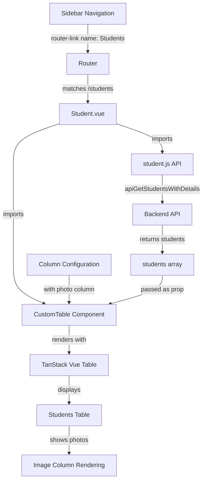

# Creating a Students Listing Page — Explained

This note explains how the Students page follows the same architectural patterns as the Tests page, with focus on reusable patterns, nested data accessors, image rendering with fallback handling, and how to extend the application with new features consistently.

---

## The Big Picture

The Students feature reuses and reinforces established patterns:



Same flow as Tests: **Navigation** → **Route** → **Component** → **API** → **Table** → **Display**.

---

## Step 1 - Create New: student.js (Explained)

### Same API pattern as test.js

```js
export function apiGetStudents() { ... }
export function apiGetStudentsWithDetails() { ... }
export function apiCreateStudent(data) { ... }
export function apiReadStudent(id) { ... }
export function apiUpdateStudent(data) { ... }
export function apiDeleteStudent(id) { ... }
```

This mirrors `test.js` exactly. Benefits:
- Developers know what to expect — consistent function naming.
- Easy to copy patterns from Tests page to Students page.
- Maintenance is predictable — all CRUD modules follow the same structure.

### Why duplicate similar modules?

You could create a generic "CRUD module factory":

```js
// Generic approach
const createCrudModule = (resource) => ({
  getAll: () => axios.get(`/api/${resource}`),
  getAllWithDetails: () => axios.get(`/api/${resource}/details`),
  // ...
})
const testAPI = createCrudModule('tests')
const studentAPI = createCrudModule('students')
```

But the explicit approach (separate `test.js` and `student.js`) is better for:
- **Clarity** — file names match feature names (easier to find code).
- **Evolution** — each resource can diverge (some might need custom endpoints).
- **Testing** — easier to mock individual modules.
- **Debugging** — stack traces clearly show which module failed.

---

## Step 2 - Create New: Student.vue (Explained)

### Reusing component structure

```vue
<template>
  <div class="content-wrapper">
    <div class="content-header">
      <!-- Header with breadcrumb -->
    </div>
    <div class="content">
      <div class="container-fluid">
        <CustomTable :title="'Student List'" :data="students" :columns="columns" />
      </div>
    </div>
  </div>
</template>
```

This is **identical in structure** to Test.vue:
- Same `content-wrapper` and `content-header` layout.
- Same three-level container nesting.
- Same CustomTable usage — only the title and data props change.

This consistency is intentional. New developers can:
1. Look at Test.vue to understand page structure.
2. Apply the same structure to Student.vue, Courses, or any other feature.
3. Focus on differences (column config, API) rather than layout.

### Image rendering column

```js
{
  accessorKey: "photo",
  header: "",
  cell: (cell) =>
    h("img", {
      style: "max-width: 50px",
      class: "profile-user-img img-fluid img-circle",
      src:
        cell.getValue() || emptyImage,
    }),
}
```

This column displays student photos. Key concepts:

**accessorKey: "photo"**
- Tells TanStack to read `row.original.photo` (the image URL from backend).

**cell function with `h()`**
- Not using default text rendering — creating an `` element programmatically.
- `cell.getValue()` — calls the accessor and gets the photo URL.
- `src: cell.getValue() || emptyImage` — if photo URL is null/empty, use fallback image.

**Why fallback images?**
- Not all students have uploaded photos.
- Without fallback, broken image icon appears (ugly UX).
- With fallback, a default avatar appears (professional UX).

```js
import emptyImage from '@/assets/images/emptyImage.png'
```

This import loads the fallback image as a URL string. Can use anywhere `src=` is needed.

### Nested data accessor

```js
{
  accessorKey: 'gender.gd_kh_full',
  header: 'Gender',
}
```

The student data structure:
```js
{
  id: 1,
  name_kh: "សិស្ស",
  gender: {
    id: 1,
    gd_kh_full: "ស្រី"      // "Female"
  },
  // ...
}
```

Dot notation `'gender.gd_kh_full'` tells TanStack:
1. Read `row.original.gender` — gets the gender object.
2. Read `.gd_kh_full` — gets the Khmer text from that object.
3. Display the final value in the table.

TanStack handles the nested accessor automatically — you just specify the path.

### Placeholder event handlers

```js
{
  header: () => [
    'Actions',
    h('button',
      {
        onClick: () => { },     // Empty placeholder
        class: 'btn btn-sm btn-success ml-3'
      },
      'Register New'
    )
  ],
  cell: ({row}) => [
    h('button',
      {
        onClick: () => { },     // Empty placeholder
        class: 'btn btn-sm btn-outline-danger mx-1'
      },
      h('i', { class: 'fa fa-trash' })
    ),
    // ...
  ],
}
```

The buttons exist but don't do anything yet (`onClick: () => { }`). This is intentional:
- Future sessions will implement student CRUD operations (Create, Edit, Delete).
- UI is ready, logic will be added incrementally.
- Allows page to render without errors before handlers are ready.

---

## Step 3 - Edit: Add Student Route (Explained)

### Route structure consistency

```js
{
    path: '/students',
    name: 'Students',
    components: {
        navbar: Navbar,
        sidebar: Sidebar,
        footer: Footer,
        default: Student,
    },
    meta: { guarded: true },
},
```

This is **identical structure** to the Tests route. Only differences:
- `path: '/students'` instead of `/tests`.
- `name: 'Students'` instead of `'Tests'`.
- `default: Student` instead of `Test`.

The router pattern is now established. Every new page feature will follow this exact format.

### Why this consistency matters

```js
// ❌ Inconsistent routes
{ path: '/students', name: 'StudentList', component: StudentPage }  // Different naming
{ path: '/api/tests', name: 'Tests', components: { ... } }          // Wrong path format
{ path: '/users', name: 'Users' }                                   // Missing guard

// ✅ Consistent routes
{ path: '/students', name: 'Students', components: { ... }, meta: { guarded: true } }
{ path: '/tests', name: 'Tests', components: { ... }, meta: { guarded: true } }
{ path: '/courses', name: 'Courses', components: { ... }, meta: { guarded: true } }
```

Consistency means:
- Predictable paths and names — `/resource`, `'Resource'`.
- All guarded routes follow the same format.
- New developers can copy-paste the route template and change only 3 values.

---

## Step 4 - Edit: Add Students Navigation Link (Explained)

### Sidebar hierarchy

Before:
```vue
<li class="nav-header">Academic Management</li>
<li class="nav-item">Tests</li>
```

After:
```vue
<li class="nav-header">Academic Management</li>
<li class="nav-item">Students</li>
<li class="nav-item">Tests</li>
```

Students is listed first under the Academic Management section because:
- Users interact with Students before Tests (registration first, then testing).
- Logical workflow: Students → Courses → Tests.

### router-link by name

```vue
<router-link :to="{ name: 'Students' }" active-class="active" class="nav-link">
```

When user clicks:
1. Vue Router resolves `'Students'` name to the route.
2. Route name matches the entry in `router.js`: `{ name: 'Students', path: '/students' }`.
3. Router updates URL to `/students`.
4. Vue Router guard checks `meta: { guarded: true }` — user must be authenticated.
5. If authenticated, Student.vue mounts.
6. `active-class="active"` is applied (link gets highlighted).

---

## Data Flow: From Backend to Display

```
Backend Database (students table with relations)
         ↓
API Endpoint: /api/students/details
         ↓
axios.get() returns Promise
         ↓
.then() receives response.data.students = [ {...}, {...}, ... ]
         ↓
students.value = array  (reactive assignment)
         ↓
CustomTable :data="students" (prop binding)
         ↓
useVueTable receives students array
         ↓
Column configuration extracts data:
  - photo → image URL
  - name_kh → Khmer text
  - gender.gd_kh_full → nested data
  - creator.name + created_at → combined data
         ↓
v-for loops over rows
         ↓
FlexRender renders headers and cells
         ↓
<table> with data visible
         ↓
User sees Students table with photos, names, etc.
```

Each step is reactive:
- Update `students.value` → table re-renders.
- Sort/filter in table → rows update.
- Pagination changes → page updates.

---

## Pattern Extension: Adding New Features

The Students page demonstrates **extensibility**. To add another feature (Courses, Classes, etc.):

1. **Create API module** — copy `student.js`, rename to `course.js`, change endpoints.
2. **Create page component** — copy `Student.vue`, rename to `Course.vue`, update imports/data.
3. **Add route** — copy Students route, change name/path/component.
4. **Add sidebar link** — copy Students link, change name/icon/text.

That's it. No new patterns to learn — just repeat the established structure.

---

## Reusable Patterns Reinforced

| Pattern | Session | Reused In |
|---------|---------|-----------|
| API module with 6 CRUD functions | 4.0, 4.2 | 5.0 (student.js) |
| Page component with CustomTable | 4.3 | 5.0 (Student.vue) |
| Column configuration with cell rendering | 4.3 | 5.0 (photo column) |
| Route with named layouts and guards | 3.0, 4.0 | 5.0 (Students route) |
| Sidebar navigation link | 4.0 | 5.0 (Students link) |
| onMounted data fetch with modals | 4.0, 4.2 | 5.0 (generateStudents) |

Students page uses **zero new concepts**. It's 100% application of earlier sessions' patterns.

---

## Summary Flow: Adding Students Feature

```
1. Backend has students table with related data (gender, creator, photos)
   ↓
2. Create student.js API module
   - Mirrors test.js structure
   - Six functions for CRUD + details variant
   ↓
3. Create Student.vue page
   - Same layout structure as Test.vue
   - Column config includes nested accessors
   - Photo column with fallback image rendering
   ↓
4. Add Students route to router.js
   - Same route structure as Tests
   - Named layout components
   - Authentication guard
   ↓
5. Add Students link to sidebar
   - router-link by name
   - Font Awesome icon
   - Under Academic Management section
   ↓
6. User navigates to Students
   - Sidebar click → router-link → /students
   - Route guard validates auth
   - Student.vue mounts
   ↓
7. onMounted fires
   - Loading modal shows
   - apiGetStudentsWithDetails() fetches data
   - students.value populated
   - CloseModal() hides spinner
   ↓
8. CustomTable receives students data
   - Column config extracts fields
   - Photo column renders with fallback
   - Nested gender data displays
   - TanStack handles sorting/filtering/pagination
   ↓
9. User sees Students table
   - Photos, names, gender, phone, creator, updater
   - Can search, sort, paginate
   - Action buttons ready for future CRUD handlers
```

**Key insight**: Students page demonstrates architectural maturity — new features are created by following established patterns, not by inventing new solutions each time.
