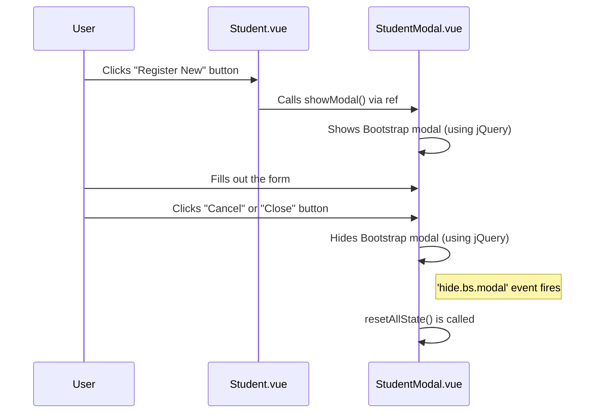

# Student Registration Modal — Explained

This document explains the concepts and techniques used to create the student registration modal. We'll cover why a dedicated date picker library was chosen, how the modal component is structured, and how it communicates with its parent page.

---

## The Big Picture

The goal is to allow users to register new students without leaving the main students list. The solution involves a modal dialog that appears on top of the current page.

Here's the flow:
1.  The user clicks the "Register New" button on the `Student.vue` page.
2.  The `Student.vue` page calls a method on the `StudentModal.vue` component to show itself.
3.  The `StudentModal.vue` component displays a form with fields for student information.
4.  The user fills out the form and can select a date of birth using a calendar-style date picker.
5.  When the modal is closed, its internal state (the form data) is reset, ready for the next use.

This pattern encapsulates the registration logic within a reusable modal, keeping the main `Student.vue` page clean and focused on displaying the list of students.

---

## Step 1 - Why Install a Date Picker?

While a standard `<input type="date">` works, a dedicated library like `@vuepic/vue-datepicker` offers several advantages:

-   **Consistent Appearance**: It looks the same across all browsers, unlike the native date input, which varies significantly.
-   **Better User Experience**: It provides a clean, modern calendar interface that is often more intuitive than native browser pickers.
-   **Advanced Formatting**: You can easily control the display format (e.g., `dd-MM-yyyy`) and the underlying data format (`model-type`), ensuring data consistency.
-   **Feature-Rich**: It includes options to disable time picking, set date ranges, and more, with simple configuration.

By installing this library, we improve the form's usability and ensure that the date of birth is captured in a reliable format.

---

## Step 2 - How `StudentModal.vue` Works

This component is a self-contained unit responsible for the entire registration form and its behavior.

### Vue `<script setup>` and Composition API

-   **`<script setup>`**: This is a compile-time syntactic sugar that makes using the Composition API more ergonomic. Code inside it is executed once when the component instance is created.
-   **`reactive`**: `const studentObj = reactive({...});` creates a reactive object. Any changes to its properties will trigger updates in the template. This is perfect for managing form data.
-   **`onMounted`**: The `onMounted` hook registers a callback to be executed after the component has been mounted to the DOM. We use it here to set up a jQuery event listener that resets the form (`resetAllState`) whenever the Bootstrap modal is hidden.

### Bootstrap, jQuery, and Vue working together

-   **Bootstrap Markup**: The template uses standard HTML structure for a Bootstrap modal. Attributes like `data-backdrop="static"` and `data-keyboard="false"` prevent the modal from closing accidentally.
-   **jQuery for Control**: Although Vue manages the DOM, Bootstrap 4's JavaScript components (like modals) rely on jQuery. We use `import $ from 'jquery'` and then `$('#STUDENT-MODAL').modal('show')` or `hide()` to control the modal programmatically. This is a common pattern when integrating legacy libraries with Vue.

### Exposing Functionality with `defineExpose`

-   **`defineExpose({ showModal, hideModal })`**: This is a crucial part of the component's design. It makes the `showModal` and `hideModal` functions available to the parent component (`Student.vue`). Without this, the parent would have no way to open or close the modal. This creates a clear and explicit API for the component.

### State Management and Reset

-   **`studentObj` and `studentErrObj`**: Two reactive objects manage the form's state. `studentObj` holds the data entered by the user, while `studentErrObj` is designed to hold validation error messages for each field.
-   **`resetAllState()`**: When the modal is closed, we want to clear any data the user entered. This function copies the original, empty state (`defaultStudentObj`) back into `studentObj`, effectively resetting the form. This ensures that the form is always clean when it's opened again.

---

## Step 3 - How `Student.vue` Integrates the Modal

The `Student.vue` page acts as the owner and controller of the `StudentModal`.

### Template Refs (`ref`)

-   **`const StudentModalRef = ref(null);`**: This declares a template ref.
-   **`<StudentModal ref="StudentModalRef" />`**: In the template, the `ref` attribute attaches the `StudentModal` component instance to the `StudentModalRef`.
-   **Accessing the Instance**: After the component is mounted, `StudentModalRef.value` will hold the actual instance of the `StudentModal` component. This gives us direct access to any properties or methods exposed by `defineExpose`.

### Triggering the Modal

-   **`onClick: () => StudentModalRef.value.showModal()`**: The "Register New" button's click handler now has a clear job: access the modal component via its ref and call the `showModal` function that we exposed. This is the connection point between the parent page and the child modal.

---

## Summary Flow

The end-to-end interaction follows this sequence:

This architecture creates a clean separation of concerns. The `Student.vue` page doesn't need to know anything about the form's internal state, and the `StudentModal.vue` component doesn't need to know what triggered it. It just waits to be told when to show up.