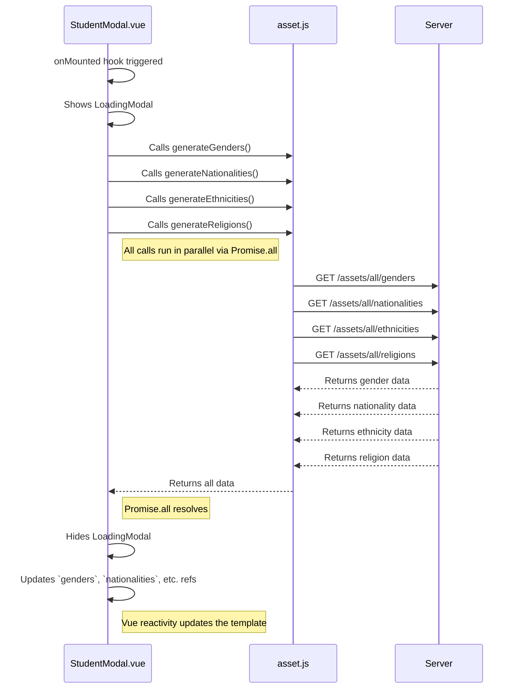

# Populating Dropdowns — Explained

This document explains the concepts behind populating form dropdowns with dynamic data from an API. We'll explore why we created a dedicated API module for "assets," how the `StudentModal` fetches and manages this data, and the benefits of running API calls in parallel.

---

## The Big Picture

To make the student registration form user-friendly, we need to replace hardcoded or manual inputs for things like "Gender" or "Nationality" with dropdown menus populated from a central source of truth—our backend API.

The workflow is as follows:
1.  **Organize API Calls**: A new file, `asset.js`, is created to group all functions that fetch "master data" or "assets."
2.  **Fetch Data on Load**: When the `StudentModal` component is first created, it immediately calls all the necessary API functions to get the lists of genders, nationalities, etc.
3.  **Run in Parallel**: To be efficient, these API calls are executed concurrently using `Promise.all`. A loading indicator is shown to the user during this process.
4.  **Store and Render**: The fetched data is stored in reactive variables (`ref`s). Vue's reactivity system automatically updates the template, and `v-for` loops render the data as `<option>` elements inside the `<select>` dropdowns.

This approach ensures that the form is always populated with the latest data from the server without sacrificing performance.

---

## Step 1 - Why Create `asset.js`?

As an application grows, the number of API calls increases. Grouping them by their domain or purpose is a critical organizational strategy.

-   **Separation of Concerns**: The `asset.js` file is responsible *only* for fetching master data. This is distinct from `student.js`, which handles CRUD operations for students. This separation makes the code easier to understand, maintain, and debug.
-   **Reusability**: If another part of the application needs the list of genders, it can simply import and use `apiGetAllGenders()` from `asset.js`. This avoids code duplication.
-   **Scalability**: As more types of assets are needed (e.g., provinces, districts), we can simply add new functions to `asset.js`, keeping all related logic in one place.

---

## Step 2 - How `StudentModal.vue` Fetches and Renders Data

The modal component is now responsible for more than just its own UI; it also manages the data required to populate its form fields.

### Data Fetching in `onMounted`

-   **Lifecycle Hook**: `onMounted` is the ideal place to fetch initial data for a component. It runs after the component has been created and added to the DOM, but before it's visible to the user (if data loading is handled correctly).
-   **Asynchronous Operations**: Since API calls are asynchronous, the `onMounted` callback is marked as `async`.

### Efficiency with `Promise.all`

Instead of fetching data sequentially like this:

```javascript
// Inefficient: waits for each call to finish before starting the next
await generateGenders();
await generateNationalities();
await generateEthnicities();
await generateReligions();
```

We use `Promise.all`:

```javascript
await Promise.all([
  generateGenders(),
  generateNationalities(),
  generateEthnicities(),
  generateReligions(),
]);
```

-   **Parallel Execution**: `Promise.all` takes an array of promises (the return values of our `async` API functions) and runs them all at the same time.
-   **Improved Performance**: The total wait time is determined by the *longest* single API call, not the sum of all of them. This significantly speeds up the initial loading of the component.
-   **Error Handling**: If any one of the promises in the array rejects (fails), `Promise.all` immediately rejects, and the `catch` block is executed. This provides a single, convenient place to handle errors for the entire group of operations.

### Reactivity and Rendering with `v-for`

-   **`ref` for Arrays**: We use `const genders = ref([])` to create a reactive variable that will hold the array of gender objects.
-   **Automatic Updates**: When the API call completes and we assign the result to `genders.value`, Vue's reactivity system detects the change.
-   **Dynamic Rendering**: The `v-for` loop in the template, which is bound to the `genders` ref, automatically re-runs and renders the `<option>` elements for the dropdown.

```html
<select v-model="studentObj.gender_id">
  <!-- This loop runs automatically when `genders` is updated -->
  <option v-for="{ id, gd_kh_full } in genders" :key="id" :value="id">
    {{ gd_kh_full }}
  </option>
</select>
```

-   **`:key` and `:value`**:
    -   `:key="id"` is essential for Vue to efficiently track and update the list.
    -   `:value="id"` sets the actual value of the option (the gender's ID), which is what gets stored in `studentObj.gender_id` when the user makes a selection.
    -   The text between the `<option>` tags (`{{ gd_kh_full }}`) is what the user sees.

---

## Summary Flow

The data loading and rendering process follows this sequence:



This robust pattern ensures a fast, efficient, and maintainable way to populate forms with dynamic data, creating a seamless experience for the user.