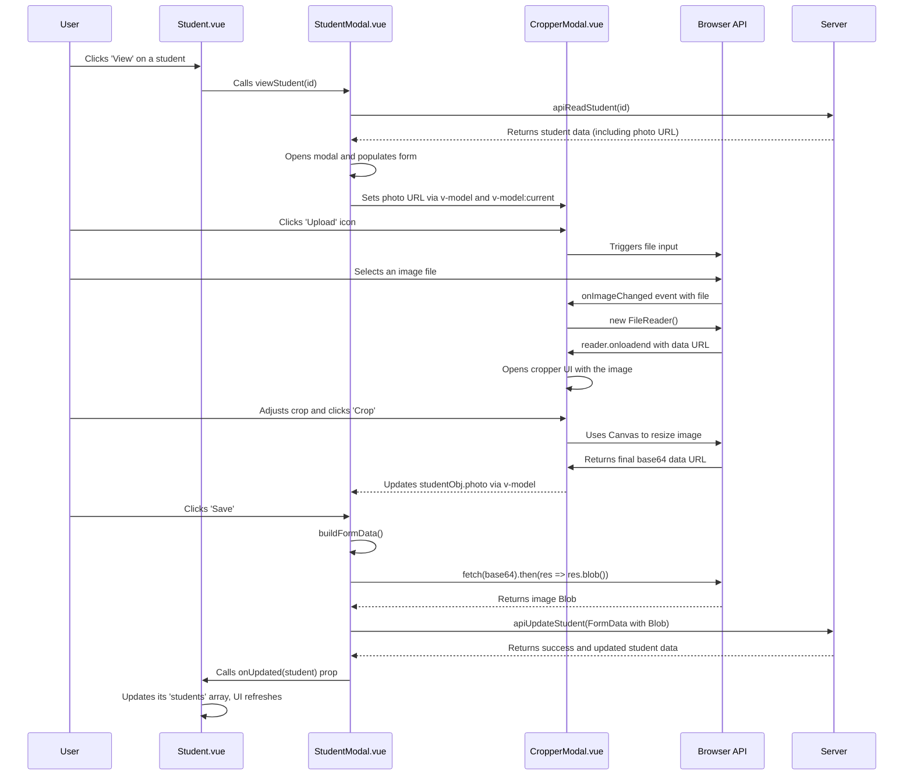

# Image Cropping with vue-advanced-cropper — Explained

This document explains the concepts and techniques used to integrate the `vue-advanced-cropper` library into our Vue 3 application. We'll break down how the `CropperModal` component works and how it communicates with the parent `StudentModal` to manage image uploads.

---

### The Big Picture

The goal is to allow users to upload a profile picture, crop it to a specific aspect ratio, and then save it to the server. The process involves several steps that span across multiple components and browser APIs.

Here's the high-level workflow:

1.  **User Action**: The user clicks an "upload" button, which triggers a hidden file input field.
2.  **File Selection**: The user selects an image from their local machine.
3.  **Read and Display**: The browser's `FileReader` API reads the image file as a data URL. This data is then used to display the image in the `vue-advanced-cropper` component, which is presented inside a modal.
4.  **Cropping**: The user adjusts the selection in the cropper UI. The cropper emits the coordinates and a canvas representation of the cropped area in real-time.
5.  **Finalizing the Crop**: When the user clicks "Crop," we take the final cropped canvas, draw it onto a new canvas with our desired dimensions (`454x454`), and convert it to a base64 data URL.
6.  **Data Binding**: This data URL is passed back to the `StudentModal` via `v-model`.
7.  **Form Submission**: When the main student form is submitted, the base64 data URL is converted into a `Blob` and appended to a `FormData` object, which is then sent to the server via an API call.

---

### Step 1: The `CropperModal.vue` Component

This component encapsulates all the logic for cropping. It's designed to be reusable and self-contained.

#### Key Concepts Explained:

-   **`defineModel`**: This is a new feature in Vue 3 that simplifies creating components with two-way data binding (`v-model`). We use it for three different values:
    -   `v-model`: The primary model for the cropped image data (the base64 string).
    -   `v-model:current`: A secondary model to hold the student's original image. This is used for the "reset" functionality.
    -   `v-model:error`: A model to pass validation error messages from the parent to the cropper component.

-   **`vue-advanced-cropper`**: This library provides the `<Cropper>` component.
    -   `:src`: We bind this to a reactive `ref` (`cropSrc`) which holds the data URL of the image the user selected.
    -   `:stencil-props`: This allows us to configure the cropping area. We set the `aspectRatio` to `width / height` to enforce a square selection.
    -   `@change`: This event fires whenever the user modifies the crop. It provides the `canvas` of the cropped area, which we store in a variable.

-   **`FileReader` API**: This is a standard web API for reading files from the user's computer.
    -   `reader.readAsDataURL(file)`: This command starts reading the contents of the specified `File` or `Blob`.
    -   `reader.onloadend`: This event handler is called when the read operation is finished. The result (the base64 data URL) is available on `reader.result`. We use this result to set our `cropSrc` and show the cropper modal.

-   **HTML Canvas API**: The `<canvas>` element is used for drawing graphics on the fly. We use it to process the final cropped image.
    -   `cropperRef.value.getResult()` could also be used, but creating our own canvas gives us more control over the final output size.
    -   `canvas.getContext('2d').drawImage(...)`: This method lets us draw an image onto the canvas. We draw the `croppedCanvas` provided by the cropper onto a new canvas that is sized exactly to our required `454x454` dimensions.
    -   `canvas.toDataURL('image/png')`: This method returns a data URL containing a representation of the image in the format specified. This base64 string is what we pass back to the parent component.

---

### Step 2: The `StudentModal.vue` Component

This component is the form for creating and editing student data. It now integrates the `CropperModal`.

#### Key Concepts Explained:

-   **`buildFormData(data, includePhoto)`**: This function is essential for preparing data to be sent to the server, especially when files are involved.
    -   **`FormData`**: This is a special object type that can be sent with an HTTP request (typically `POST`). It's designed to simulate a form submission and is the standard way to upload files.
    -   **`fetch(data.photo).then(res => res.blob())`**: The cropped image is a base64 data URL string. Servers expect file uploads as binary data, not a string. This line fetches the data from the data URL and converts it into a `Blob` (Binary Large Object), which is a file-like object of immutable, raw data.
    -   `form.append('photo', blob, 'photo.jpg')`: We append the `Blob` to our `FormData` object. The first argument is the field name the server expects (`photo`), the second is the blob itself, and the third is the filename.

-   **Handling Create vs. Update**:
    -   For a **new student**, we always include the photo data in the `FormData`.
    -   For an **existing student**, we only want to upload a new photo if the user has actually changed it. We track this by comparing the current `studentObj.photo` with the `currentImage` that was loaded when the modal opened. This prevents unnecessary file uploads and processing on the server.

-   **Callback Props (`onCreated`, `onUpdated`, `onDeleted`)**:
    -   This is a common pattern in Vue for child-to-parent communication. The parent component (`Student.vue`) passes functions down to the `StudentModal`.
    -   When the `StudentModal` successfully completes an API call (create, update, or delete), it calls the corresponding function prop, passing the new/updated/deleted student data back up to the parent.

---

### Step 3: The `Student.vue` Page

This is the parent component that displays the list of students.

#### Key Concepts Explained:

-   **Reactive List Updates**: By using the callback props, the `Student.vue` page can modify its local `students` array directly.
    -   `onStudentCreated`: The new student is added to the array using the spread syntax (`[...students.value, student]`).
    -   `onStudentUpdated`: The `.map()` method is used to create a new array, replacing the old student object with the updated one.
    -   `onStudentDeleted`: The `.filter()` method is used to create a new array that excludes the deleted student.
    -   Because `students` is a reactive `ref`, any changes to it will automatically trigger a re-render of the `CustomTable`, and the UI will update instantly.

-   **Calling Child Component Methods**:
    -   We use a `ref` (`StudentModalRef`) on the `<StudentModal>` component.
    -   This gives us direct access to the child component's instance.
    -   We can then call methods that the child has exposed via `defineExpose({ viewStudent, removeStudent })`. This is how the "View" and "Delete" buttons in the table can trigger actions inside the modal.

---

### Summary Flow

Here is the end-to-end data and event flow for updating a student's photo:

