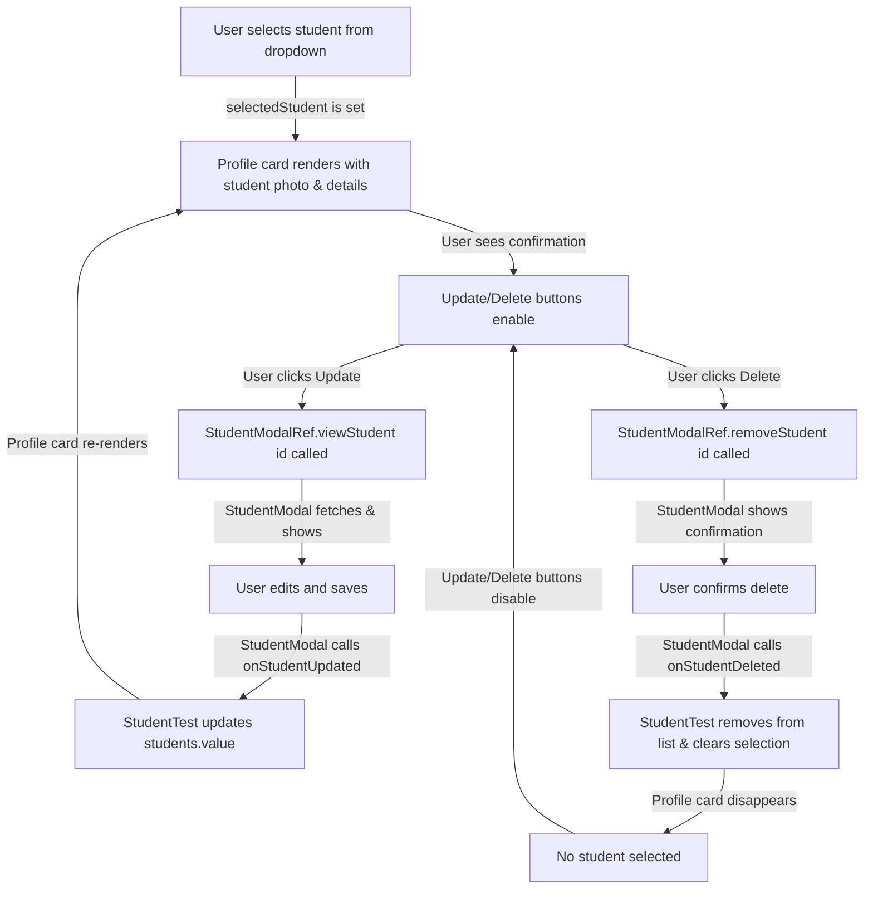

# Student Profile Display and Modal Integration — Explained

This document explains the concepts and patterns behind displaying student profile information and integrating the StudentModal component for CRUD operations in the StudentTest page, as demonstrated in Session 6.2. We'll explore Vue's template references, component event handling, computed property patterns, and data synchronization between parent and child components.

---

### The Big Picture

Session 6.2 transforms the StudentTest page from a simple student selector into a complete student management hub. The core idea is:

1. **Profile as context**: When a student is selected, their profile card immediately displays, giving administrators visual confirmation and quick access to key information.
2. **Modal as editor**: Instead of inline editing, the StudentModal component provides a dedicated interface for creating, updating, and viewing student details.
3. **Template references**: Using `ref()` on a component allows the parent to call methods on the child, like `StudentModalRef.showModal()` and `StudentModalRef.viewStudent(id)`.
4. **Event callbacks**: When StudentModal completes an operation (create, update, delete), it calls callback functions passed from the parent to update the student list.
5. **Reactive data sync**: The `selectedStudent` ref keeps the profile card in sync with the dropdown selection, automatically updating displayed information.

The result is a professional management interface where students can be viewed and edited without losing context of the StudentTest page.

---

### Step 1: Student Profile Card Display (Explained)

#### Why show a profile card when a student is selected?

Displaying student details provides several UX benefits:

- **Confirmation**: Administrators can visually confirm they've selected the correct student before creating a test assignment.
- **At-a-glance info**: Key details (photo, names, contact info) are immediately visible without clicking elsewhere.
- **Accessibility**: For users with visual impairments or those less familiar with the system, seeing the full profile builds confidence in the selection.
- **Action-enabling**: The profile card naturally contains the CRUD action buttons, making their purpose clear.

#### Profile Image and Names

```javascript
:src="selectedStudent?.photo || emptyImage"
```

This line demonstrates **optional chaining** (`?.`) and **nullish coalescing** (`||`):

- `selectedStudent?.photo`: If `selectedStudent` is `null` or `undefined`, don't try to access `.photo` — just return `undefined`. Otherwise, return the photo value.
- `|| emptyImage`: If the photo is falsy (undefined, null, empty string), use the `emptyImage` default instead.

At runtime, when a student is selected:
1. `selectedStudent.value = { id: 1, photo: '/path/to/photo.jpg', name_kh: 'ឌាវីដ', ... }`
2. The template renders: ``

If the student has no photo stored:
1. `selectedStudent.value = { id: 1, photo: null, name_kh: 'ឌាវីដ', ... }`
2. The template renders: `` (fallback to gray placeholder)

#### Student Names in Khmer and English

```vue
<h3 class="profile-username text-center">{{ selectedStudent?.name_kh ?? '-------' }}</h3>
<h3 class="profile-username text-center">{{ selectedStudent?.name_en ?? '-------' }}</h3>
```

The `??` operator (nullish coalescing) differs from `||`:
- `??` returns the right side only if the left is `null` or `undefined` — not if it's an empty string or `false`.
- `||` returns the right side if the left is any falsy value (undefined, null, '', 0, false).

This means if a student has `name_kh = ''` (intentionally empty), `??` will keep it empty, while `||` would fall back to `'-------'`.

#### Student Details List

```vue
<li class="list-group-item">
  <b>ភេទ</b>
  <h6 class="float-right">{{ selectedStudent?.gender?.gd_kh_full }}</h6>
</li>
```

Here we're using **nested optional chaining**: `selectedStudent?.gender?.gd_kh_full`. This safely traverses two levels:
1. If `selectedStudent` is null, stop and return undefined.
2. If `selectedStudent.gender` is null, stop and return undefined.
3. Otherwise, return `selectedStudent.gender.gd_kh_full`.

At runtime, if the API returned:
```javascript
selectedStudent = {
  name_kh: 'ឌាវីដ',
  gender: { gd_kh_full: 'ប្រុស', gd_en_full: 'Male' },
  dob: '1995-05-15',
  phone: '0123456789'
}
```

Then the template displays:
```
ភេទ                   ប្រុស
ថ្ងៃខែឆ្នាំកំណើត   1995-05-15
លេខទូរស័ព្ទ           0123456789
```

---

### Step 2: CRUD Buttons and Disabled States (Explained)

#### The `:disabled` Binding

```vue
<button type="button" @click="StudentModalRef.viewStudent(selectedStudent?.id)"
  :disabled="!selectedStudent"
  class="btn btn-primary btn-inline-block mx-1">Update <i class="fas fa-edit"></i></button>
```

The `:disabled="!selectedStudent"` binding works as follows:

- If `selectedStudent.value === null`, then `!selectedStudent` evaluates to `true`, and the button is disabled.
- If `selectedStudent.value` is an object (a selected student), then `!selectedStudent` evaluates to `false`, and the button is enabled.

At runtime:

1. **Initial state**: User opens StudentTest page → `selectedStudent` is `null` → Update and Delete buttons are disabled (greyed out).
2. **After selection**: User selects a student from the dropdown → `selectedStudent = { id: 5, name_kh: 'សុខ', ... }` → Update and Delete buttons become enabled.
3. **Delete operation**: User clicks Delete → StudentModal deletes the student → `onStudentDeleted(student)` is called → `selectedStudent.value = null` → Buttons disable again.

This pattern prevents accidental operations when no context is available.

---

### Step 3: Component References and Method Calls (Explained)

#### What is a Template Reference?

In Vue, a `ref()` creates a reactive variable. When you use `ref()` on a component in the template, it stores a reference to that component instance:

```javascript
const StudentModalRef = ref(null);
```

```vue
<StudentModal ref="StudentModalRef" ... />
```

After the component mounts, `StudentModalRef.value` holds the actual StudentModal instance, allowing you to call its methods:

```javascript
StudentModalRef.value.showModal()        // Opens the modal for creating a new student
StudentModalRef.value.viewStudent(5)     // Opens the modal for editing student with id=5
StudentModalRef.value.removeStudent(5)   // Deletes the student with id=5
```

#### Why use method calls instead of v-model or events?

There are three common patterns for parent-child communication in Vue:

1. **Props and Events** (Recommended for most cases):
   - Parent passes data via props
   - Child emits events when data changes
   - Pros: One-way data flow, easier to debug
   - Cons: Verbose for multiple operations

2. **v-model** (Recommended for form inputs):
   - Two-way binding shorthand
   - Pros: Clean syntax for form components
   - Cons: Assumes single "value" concept

3. **Template References and Method Calls** (Used here):
   - Parent holds a ref to the child component
   - Parent calls methods on the child directly
   - Pros: Simple for imperative operations (open modal, delete item)
   - Cons: Less structured, harder to test in isolation

In this case, method calls are appropriate because:
- We're triggering imperative actions (show, edit, delete), not syncing data.
- StudentModal expects an ID (which we have) and will fetch/handle the full flow internally.
- It keeps StudentTest clean by delegating student management to StudentModal.

#### At Runtime

When the user clicks "Update":

1. **Template** detects the click: `@click="StudentModalRef.viewStudent(selectedStudent?.id)"`
2. **JavaScript** executes: `StudentModalRef.value.viewStudent(5)` (where 5 is the student ID)
3. **StudentModal** receives the call and:
   - Fetches the full student data from the API
   - Populates its form fields
   - Shows the modal to the user
4. **User** edits and clicks "Save"
5. **StudentModal** calls the `onUpdated` callback: `props.onUpdated(updatedStudent)`
6. **StudentTest** receives the callback and updates `students.value` and `selectedStudent.value`
7. **Template** re-renders with the new student data

This keeps StudentTest focused on test management while StudentModal handles all student-specific logic.

---

### Step 4: Callback Functions for Data Synchronization (Explained)

#### Why pass callback functions as props?

When StudentModal completes a CRUD operation, it needs to notify the parent (StudentTest) so the student list can be updated. Three approaches:

1. **Events** (emit):
   ```javascript
   // In StudentModal
   emit('updated', student);
   // In StudentTest
   <StudentModal @updated="onStudentUpdated" />
   ```

2. **Callbacks** (function props):
   ```javascript
   // In StudentTest
   :onUpdated="onStudentUpdated"
   // In StudentModal
   props.onUpdated(student);
   ```

3. **Direct mutation**:
   ```javascript
   // In StudentModal
   students.value = students.value.map(...) // Modifies parent's ref
   ```

We use callbacks here because:
- StudentModal needs to notify the parent of specific events (created, updated, deleted).
- Callbacks are simpler than emitting multiple events and clearer than direct mutation.
- They naturally group related operations (the callback receives the modified student data).

#### The onStudentUpdated Function

```javascript
function onStudentUpdated(student) {
  students.value = students.value.map((obj) =>
    obj.id !== student.id ? obj : student
  );
  selectedStudent.value = student;
}
```

This function does two things:

1. **Update the student list**:
   ```javascript
   students.value = students.value.map((obj) =>
     obj.id !== student.id ? obj : student
   );
   ```
   - Iterates through all students in the list.
   - If the student's ID doesn't match the updated student, keep the original.
   - If the ID matches, replace with the updated student data.
   - Returns a new array, triggering Vue reactivity.

2. **Update the selection**:
   ```javascript
   selectedStudent.value = student;
   ```
   - Ensures the profile card displays the latest data immediately.
   - If the user edited the selected student, the changes are visible instantly (optimistic update pattern).

At runtime:

1. **Before update**: `students.value = [{ id: 1, name_kh: 'ឌាវីដ', phone: '0111111111' }]`
2. **User edits phone** in StudentModal to '0222222222'
3. **StudentModal calls** `onStudentUpdated({ id: 1, name_kh: 'ឌាវីដ', phone: '0222222222' })`
4. **Function executes**:
   - Map finds the student with id=1 and replaces it
   - `selectedStudent.value` is updated to the new student object
5. **Template re-renders**:
   - The profile card shows the new phone number: `0222222222`
   - The student list shows the updated information
6. **Result**: The UI is instantly consistent, reflecting the update everywhere the student appears

#### The onStudentDeleted Function

```javascript
function onStudentDeleted(student) {
  students.value = students.value.filter((obj) => obj.id !== student.id);
  if (selectedStudent.value?.id === student.id) {
    selectedStudent.value = null;
  }
}
```

This function handles the delete case with an important cleanup:

1. **Remove from list**: Filters out the deleted student.
2. **Clear selection if needed**: If the user had selected the deleted student, clear the selection (`selectedStudent.value = null`).
   - This automatically disables the Update and Delete buttons (via `:disabled="!selectedStudent"`).
   - The profile card disappears since there's no student to display.

This prevents orphaned UI state where the profile card still shows a deleted student.

---

### Summary Flow

Here's the end-to-end flow of student profile display and CRUD operations:



The flow demonstrates how data flows from the dropdown selection through the profile card, and how CRUD operations in the child component (StudentModal) properly synchronize back to the parent (StudentTest) via callbacks, ensuring the entire interface stays in sync.

